[](https://classroom.github.com/a/aRvIU2lf)
| Name           | NRP        | Kelas     |
| ---            | ---        | ----------|
| Wahid Badar Abiddin | 5025221025 | Jarkom A |


## Put your topology config image here!

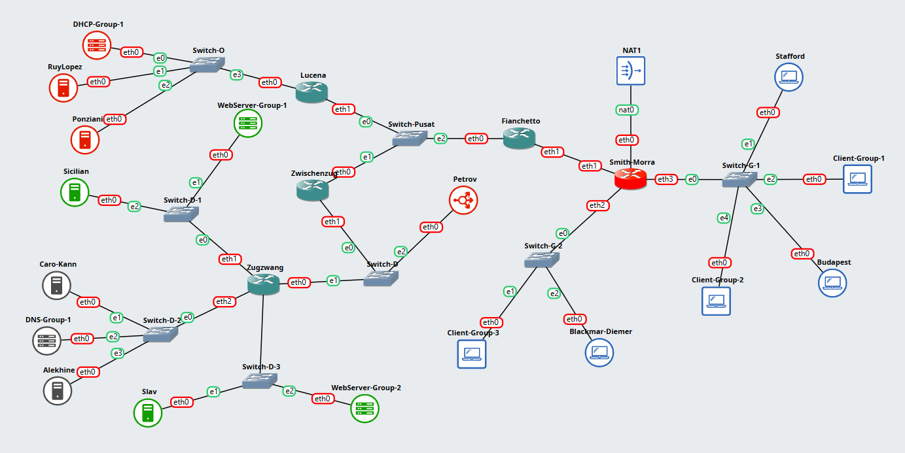

## Put your GNS3 Project file here!

[GNS3-File](https://github.com/Wbadara/Jarkom/tree/main/FP)

<br>

## Soal 1

> Menggunakan metode VLSM, buatlah pembagian subnet untuk masing-masing gedung dengan cara yang seefisien mungkin!

> _Using the VLSM method, create subnets for each building as efficiently as possible!_

**Answer:**

- Screenshot

  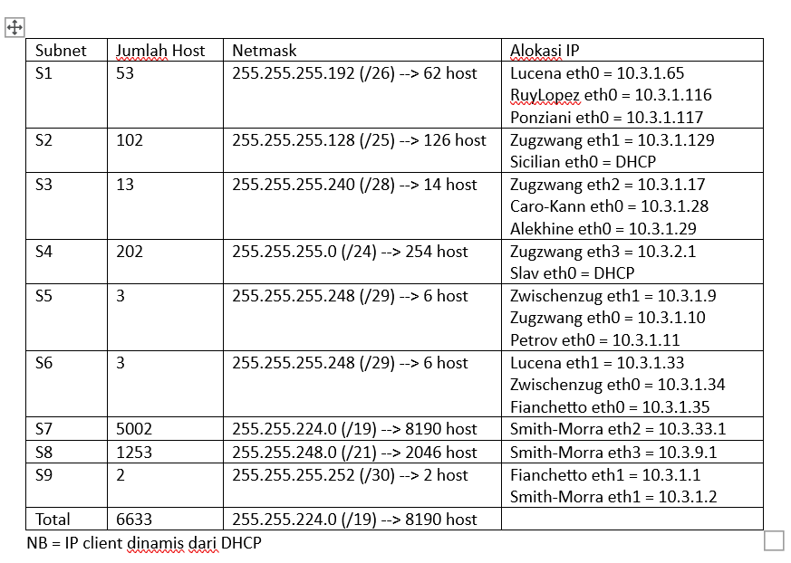

- Explanation

  Pertama saya mengelompokkan topologi menjadi beberapa subnet yang sesuai

  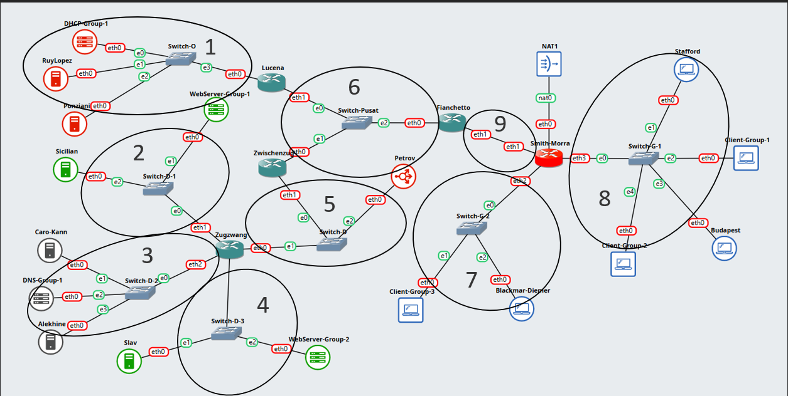

  Tentukan jumlah alamat IP yang dibutuhkan oleh tiap subnet dan lakukan labelling netmask berdasarkan jumlah IP yang dibutuhkan

  
  
  Hitung pembagian IP berdasarkan NID dan netmask tersebut menggunakan pohon

  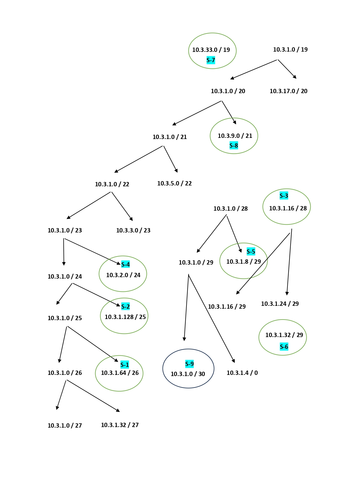

  Dari pohon tersebut akan dapat mengalokasikan IP. Kemudian lakukan konfigurasi pada masing-masing node, router, dan client

<br>

## Soal 2

> Konfigurasi semua router agar bisa terhubung ke semua jaringan. Gunakan static routing dan uji dengan melakukan ping dari **Budapest** ke **Alekhine** dan dari **Ponziani** ke **Sicilian**!

> _Configure all routers to connect to all networks. Use static routing and perform testing by pinging from **Budapest** to **Alekhine** and from **Ponziani** to **Sicilian**!_

**Answer:**

- Screenshot

  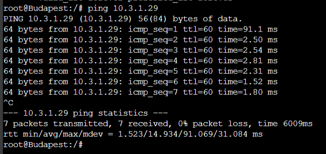

  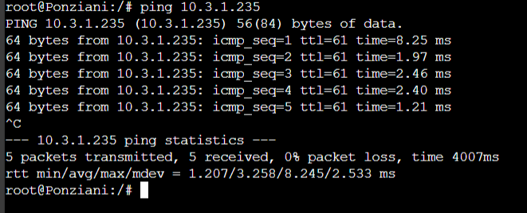

- Explanation

  Untuk dapat melakukan routing kita perlu mengetahui NID dari masing-masing subnet sehingga nanti mudah untuk mengetahui subnet tujuan
  ```
  ## Informasi Subnet
  s1 10.3.1.64/26
  s2 10.3.1.128/25
  s3 10.3.1.16/28
  s4 10.3.2.0/24
  s5 10.3.1.8/29
  s6 10.3.1.32/29
  s7 10.3.32.0/19
  s8 10.3.8.0/21
  s9 10.3.1.0/30
  ```
  Setelah itu, lakukan routing pada masing-masing router agar semua subnet dapat terhubung dengan perintah
  ```
  ip route add [subnet tujuan/netmask] via [gateway yang terhubung]
  ```
  ```
  ## Router Lucena
  ip route add 10.3.1.128/25 via 10.3.1.34
  ip route add 10.3.1.16/28 via 10.3.1.34
  ip route add 10.3.2.0/24 via 10.3.1.34
  ip route add 10.3.1.8/29 via 10.3.1.34
  ip route add 10.3.32.0/19 via 10.3.1.35
  ip route add 10.3.8.0/21 via 10.3.1.35
  ip route add 10.3.1.0/30 via 10.3.1.35
  ip route add 0.0.0.0/0 via 10.3.1.35

  ## Router Zwischenzug
  ip route add 10.3.1.64/26 via 10.3.1.33
  ip route add 10.3.1.128/25 via 10.3.1.10
  ip route add 10.3.1.16/28 via 10.3.1.10
  ip route add 10.3.2.0/24 via 10.3.1.10
  ip route add 10.3.32.0/19 via 10.3.1.35
  ip route add 10.3.8.0/21 via 10.3.1.35
  ip route add 10.3.1.0/30 via 10.3.1.35
  ip route add 0.0.0.0/0 via 10.3.1.35

  ## Router Zugzwang
  ip route add 10.3.1.64/26 via 10.3.1.9
  ip route add 10.3.1.32/29 via 10.3.1.9
  ip route add 10.3.32.0/19 via 10.3.1.9
  ip route add 10.3.8.0/21 via 10.3.1.9
  ip route add 10.3.1.0/30 via 10.3.1.9
  ip route add 0.0.0.0/0 via 10.3.1.9

  ## Router Fianchetto
  ip route add 10.3.1.64/26 via 10.3.1.33
  ip route add 10.3.1.128/25 via 10.3.1.34
  ip route add 10.3.1.16/28 via 10.3.1.34
  ip route add 10.3.2.0/24 via 10.3.1.34
  ip route add 10.3.1.8/29 via 10.3.1.34
  ip route add 10.3.32.0/19 via 10.3.1.2
  ip route add 10.3.8.0/21 via 10.3.1.2
  ip route add 0.0.0.0/0 via 10.3.1.2

  ## Router Smith-Morra
  ip route add 10.3.1.64/26 via 10.3.1.1
  ip route add 10.3.1.128/25 via 10.3.1.1
  ip route add 10.3.1.16/28 via 10.3.1.1
  ip route add 10.3.2.0/24 via 10.3.1.1
  ip route add 10.3.1.8/29 via 10.3.1.1
  ip route add 10.3.1.32/29 via 10.3.1.1
  ip route add 0.0.0.0/0 via 192.168.122.1
  ```
  Sambungkan juga dengan internet, tambahkan perintah di router yang terhubung dengan NAT yakni router Smith-Morra
  ```
  apt-get update
  apt-get insatll iptables -y
  ```
  ```
  iptables -t nat -A POSTROUTING -o eth0 -j MASQUERADE
  ```
  Kemudian pada router lainnya tambahkan DNS server
  ```
  nano /etc/resolv.conf
  ```
  ```
  nameserver 8.8.8.8
  ```
  Untuk pengujian lakukan
  ```
  ping [ip tujuan]
  ```

<br>

## Soal 3

> Berikan seluruh client (**Blackmar-Diemer, Budapest,** dan **Stafford**) IP secara dinamis dari DHCP. Range IP dibebaskan, namun tunjukkan bahwa mereka mendapatkan IP secara dinamis!

> _Assign all clients (**Blackmar-Diemer, Budapest,** and **Stafford**) dynamic IP addresses via DHCP. You may use any IP range you would like, but prove that they receive IP addresses dynamically!_

**Answer:**

- Screenshot

  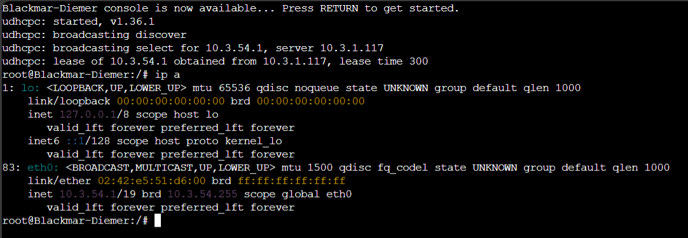

  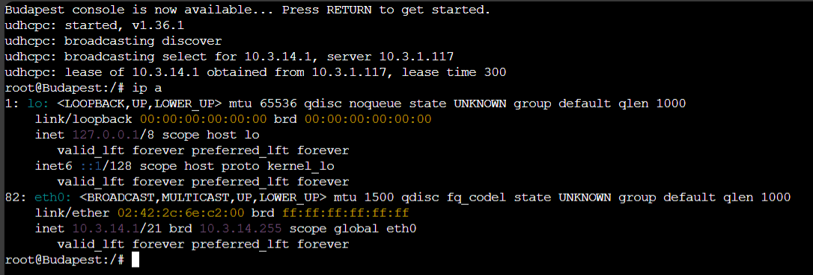

  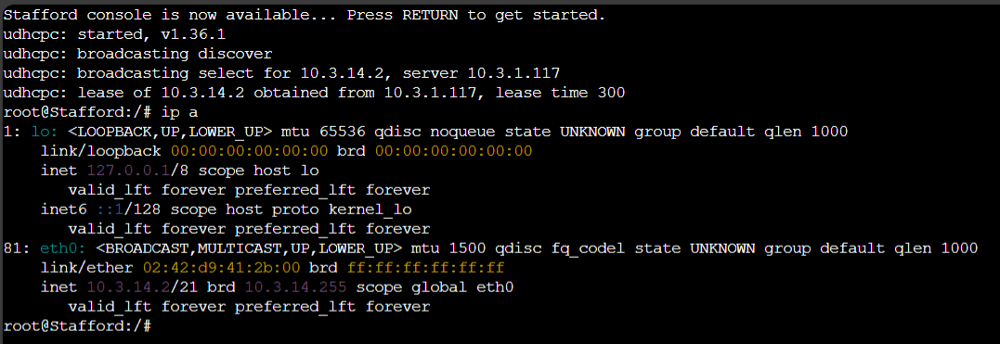

- Explanation

  Pada DHCP Server Ponziani lakukan instalasi DHCP-Server
  ```
  apt-get update
  apt-get install isc-dhcp-server
  dhcpd --version
  ```
  Edit interface dari DHCP-Server yang terhubung ke router
  ```
  nano /etc/default/isc-dhcp-server
  ```
  ```
  INTERFACESv4="eth0"
  ```
  Lakukan konfigurasi DHCP-Server
  ```
  nano /etc/dhcp/dhcpd.conf
  ```
  ```
  subnet 10.3.32.0 netmask 255.255.224.0 {
      range 10.3.54.1 10.3.54.20;
      option routers 10.3.33.1;
      option broadcast-address 10.3.54.255;
      default-lease-time 300;
      max-lease-time 6900;
  }
  
  subnet 10.3.8.0 netmask 255.255.248.0 {
      range 10.3.14.1 10.3.14.20;
      option routers 10.3.9.1;
      option broadcast-address 10.3.14.255;
      default-lease-time 300;
      max-lease-time 6900;
  }
  
  subnet 10.3.1.128 netmask 255.255.255.128 {
      range 10.3.1.230 10.3.1.240;
      option routers 10.3.1.129;
      option broadcast-address 10.3.1.255;
      option domain-name-servers 192.168.122.1;
      default-lease-time 300;
      max-lease-time 6900;
  }
  
  subnet 10.3.2.0 netmask 255.255.255.0 {
      range 10.3.2.205 10.3.2.220;
      option routers 10.3.2.1;
      option broadcast-address 10.3.2.255;
      option domain-name-servers 192.168.122.1;
      default-lease-time 300;
      max-lease-time 6900;
  }
  
  subnet 10.3.1.16 netmask 255.255.255.240 {
      range 10.3.1.20 10.3.1.30;
      option routers 10.3.1.17;
      option broadcast-address 10.3.1.31;
      option domain-name-servers 192.168.122.1;
      default-lease-time 300;
      max-lease-time 6900;
  }
  
  subnet 10.3.1.8 netmask 255.255.255.248 {
      range 10.3.1.9 10.3.1.13;
      option routers 10.3.1.9;
      option broadcast-address 10.3.1.15;
      option domain-name-servers 192.168.122.1;
      default-lease-time 300;
      max-lease-time 6900;
  }
  
  subnet 10.3.1.32 netmask 255.255.255.248 {
      range 10.3.1.33 10.3.1.37;
      option routers 10.3.1.33;
      option broadcast-address 10.3.1.39;
      option domain-name-servers 192.168.122.1;
      default-lease-time 300;
      max-lease-time 6900;
  }
  
  subnet 10.3.1.0 netmask 255.255.255.252 {
      range 10.3.1.1 10.3.1.2;
      option routers 10.3.1.1;
      option broadcast-address 10.3.1.3;
      option domain-name-servers 192.168.122.1;
      default-lease-time 300;
      max-lease-time 6900;
  }

  subnet 10.3.1.64 netmask 255.255.255.192 {
      range 10.3.1.116 10.3.1.120;
      option routers 10.3.1.65;
      option broadcast-address 10.3.1.127;
      option domain-name-servers 192.168.122.1;
      default-lease-time 300;
      max-lease-time 6900;
  }
  ```
  Jalankan DHCP-Server
  ```
  service isc-dhcp-server restart
  ```
  Kemudian semua router kita konfigurasi sebagai DHCP-Relay 
  ```
  apt-get update
  apt-get install isc-dhcp-relay -y
  ```
  Edit konfigurasi DHCP-Relay
  ```
  nano /etc/default/isc-dhcp-relay
  ```
  ```
  SERVERS="10.3.1.117"
  INTERFACES="eth0 eth1 eth2" //sesuaikan dengan output
  OPTIONS=
  ```
  Konfigurasikan IP Forwarding
  ```
  nano /etc/sysctl.conf
  ```
  ```
  net.ipv4.ip_forward=1
  ```
  Jalankan DHCP-Relay
  ```
  service isc-dhcp-relay restart
  ```

<br>

## Soal 4

> Berikan web server **Slav** dan **Sicilian** IP address yang tetap/fixed dari DHCP. 

> _Assign **Slav** and **Sicilian** web servers fixed IP addresses via DHCP._

**Answer:**

- Screenshot

  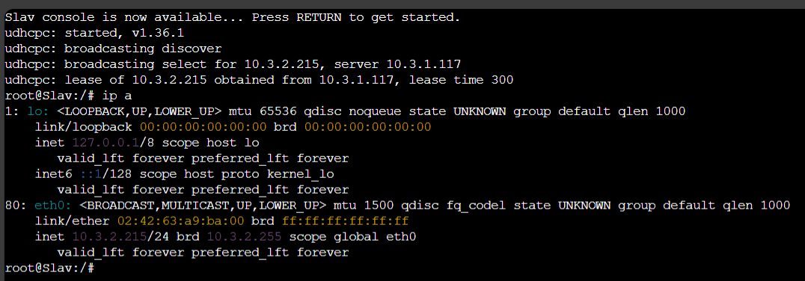

  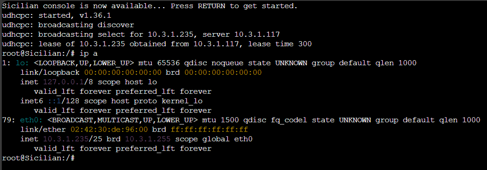

- Explanation

  Pada DHCP-Server Ponziani tambahkan konfigurasi DHCP-Server untuk subnet Web Server
  ```
  nano /etc/dhcp/dhcpd.conf
  ```
  ```
  host Slav {
      hardware ethernet 02:42:63:a9:ba:00;
      fixed-address 10.3.2.215;
  }
  
  host Sicilian {
      hardware ethernet 02:42:30:de:96:00;
      fixed-address 10.3.1.235;
  }
  ```
  Nyalakan kembali DHCP-Server
  ```
  service isc-dhcp-server restart
  ```

<br>

## Soal 5

> Buatlah konfigurasi untuk domain:  
**parkov.com** → IP Node **Slav**  
**paskarov.com** → IP Node **Sicilian** 
Pada **DNS Master Caro-Kann.** Tambahkan juga subdomain www untuk kedua domain tersebut.

> _Configure the domains:  
**parkov.com** → **Slav** Node IP  
**paskarov.com** → **Sicilian** Node IP  
On the **Caro-Kann DNS Master,** then add the www subdomain for both domains._

**Answer:**

- Screenshot

  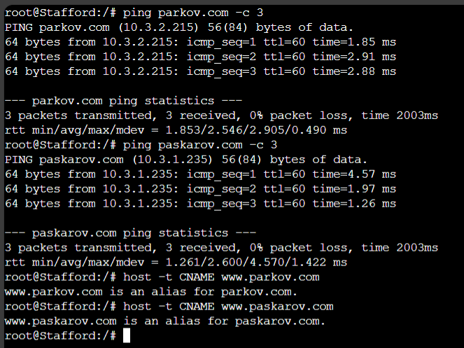

- Explanation

  Menyiapkan Caro-Kann sebagai DNS Server dengan melakukan instalasi
  ```
  apt-get update
  apt-get install bind9 -y
  ```
  Setelah itu, lakukan pengaturan pada DNS Master Caro-Kann
  ```
  nano /etc/bind/named.conf.local
  ```
  ```
  zone "parkov.com" {
      type master;
      file "/etc/bind/db.parkov";
  };

  zone "paskarov.com" {
      type master;
      file "/etc/bind/db.paskarov";
  };
  ```
  Konfigurasi juga db-nya
  ```
  nano /etc/bind/db.parkov
  ```
  ```
  $TTL 604800
  @         IN    SOA    caro-kann.parkov.com. root.parkov.com. (
                         2025102201       ; Serial
                         604800           ; Refresh
                         86400            ; Retry
                         2419200          ; Expire
                         604800 )         ; Negative Cache TTL
  ; 
  @         IN    NS     caro-kann.parkov.com.
  caro-kann IN    A      10.3.1.28
  slav      IN    A      10.3.2.215
  @         IN    A      10.3.2.215
  www       IN    CNAME  parkov.com.
  ```
  ```
  nano /etc/bind/db.paskarov
  ```
  ```
  $TTL 604800
  @         IN    SOA    caro-kann.paskarov.com. root.paskarov.com. (
                         2025102201         ; Serial
                         604800             ; Refresh
                         86400              ; Retry
                         2419200            ; Expire
                         604800 )           ; Negative Cache TTL
  ; 
  @         IN    NS     caro-kann.paskarov.com.
  caro-kann IN    A      10.3.1.28
  sicilian  IN    A      10.3.1.235
  @         IN    A      10.3.1.235
  www       IN    CNAME  paskarov.com.
  ```
  Nyalakan DNS-Server
  ```
  named -g
  ```
  Pada Client pastikan dns server mengarah ke IP Caro-Kann
  ```
  nano /etc/resolv.conf
  ```
  ```
  nameserver 10.3.1.28
  ```
  Untuk pengujian lakukan
  ```
  ping parkov.com -c 3
  ping paskarov.com -c 3
  host -t CNAME www.parkov.com
  host -t CNAME www.paskarov.com
  ```

<br>

## Soal 6

> Konfigurasikan juga **Alekhine** sebagai **DNS Slave** yang bekerja untuk membantu **Caro-Kann.** Lakukan pengujian dengan **mematikan Caro-Kann** lalu coba ping ke domain dan subdomain tersebut (pilih salah satu saja).

> _Configure **Alekhine** as a **DNS Slave** to assist **Caro-Kann**. Perform testing by **disabling Caro-Kann** and then pinging the domain and subdomain (choose only one)._

**Answer:**

- Screenshot

  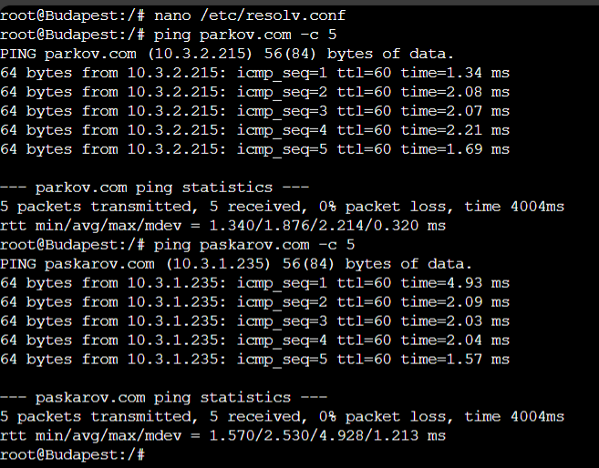

- Explanation

  Pada DNS-Master Caro-Kann lakukan perubahan konfigurasi
  ```
  nano /etc/bind/named.conf.local
  ```
  ```
  zone "parkov.com" {
      type master;
      notify yes;
      also-notify { 10.3.1.29; };
      allow-transfer { 10.3.1.29; };
      file "/etc/bind/db.parkov";
  };

  zone "paskarov.com" {
      type master;
      notify yes;
      also-notify { 10.3.1.29; };
      allow-transfer { 10.3.1.29; };
      file "/etc/bind/db.paskarov";
  };
  ```
  Edit juga db-nya
  ```
  nano/etc/bind/db.parkov
  ```
  ```
  $TTL 604800
  @         IN    SOA    caro.parkov.com. root.parkov.com. (
                         2025102201       ; Serial
                         604800           ; Refresh
                         86400            ; Retry
                         2419200          ; Expire
                         604800 )         ; Negative Cache TTL
  ; 
  @         IN    NS     caro.parkov.com.
  @         IN    NS     alekhine.parkov.com.
  caro      IN    A      10.3.1.28
  alekhine  IN    A      10.3.1.29
  slav      IN    A      10.3.2.215
  @         IN    A      10.3.2.215
  www       IN    CNAME  parkov.com.
  ```
  ```
  nano /etc/bind/db.paskarov
  ```
  ```
  $TTL 604800
  @         IN    SOA    caro.paskarov.com. root.paskarov.com. (
                         2025102201         ; Serial
                         604800             ; Refresh
                         86400              ; Retry
                         2419200            ; Expire
                         604800 )           ; Negative Cache TTL
  ; 
  @         IN    NS     caro.paskarov.com.
  @         IN    NS     alekhine.paskarov.com.
  caro      IN    A      10.3.1.28
  alekhine  IN    A      10.3.1.29
  sicilian  IN    A      10.3.1.235
  @         IN    A      10.3.1.235
  www       IN    CNAME  paskarov.com.
  ```
  Menyiapkan Alekhine sebagai DNS Slave dengan melakukan instalasi
  ```
  apt-get update
  apt-get install bind9 -y
  ```
  Setelah itu, lakukan pengaturan pada DNS Slave Alekhine
  ```
  nano /etc/bind/named.conf.local
  ```
  ```
  zone "parkov.com" {
      type slave;
      masters { 10.3.1.28; };
      file "db.parkov";
  };

  zone "paskarov.com" {
      type slave;
     masters { 10.3.1.28; };
      file "db.paskarov";
  };
  ```
  Kemudian kita restart untuk DNS Master dan nyalakan DNS Slave
  ```
  named -g
  ```
  Untuk melakukan pengujian kita matikan DNS Master, dan pada Client pastikan konfigurasi dns server mengarah ke IP Alekhine
  ```
  nano /etc/resolv.conf
  ```
  ```
  nameserver 10.3.1.29
  ```
  Kemudian bisa melakukan ping
  ```
  ping parkov.com -c 5
  ping paskarov.com -c 5
  ```

<br>

## Soal 7

> Konfigurasikan **Sicilian** agar berfungsi sebagai **web server nginx** yang akan menyajikan [halaman berikut](https://drive.google.com/file/d/1eX0ZjRKprx8T34XFAssrpc7ZE1j6Jv0j/view). Konfigurasikan juga agar **Sicilian** bisa menyimpan custom access log ke file **/tmp/access.log** dan error log ke file **/tmp/error.log.**

> _Configure **Sicilian** to function as an **nginx web server**that will serve [this page](https://drive.google.com/file/d/1eX0ZjRKprx8T34XFAssrpc7ZE1j6Jv0j/view). Also, configure **Sicilian** to save custom access logs to **/tmp/access.log** and error logs to **/tmp/error.log.**_

**Answer:**

- Screenshot

  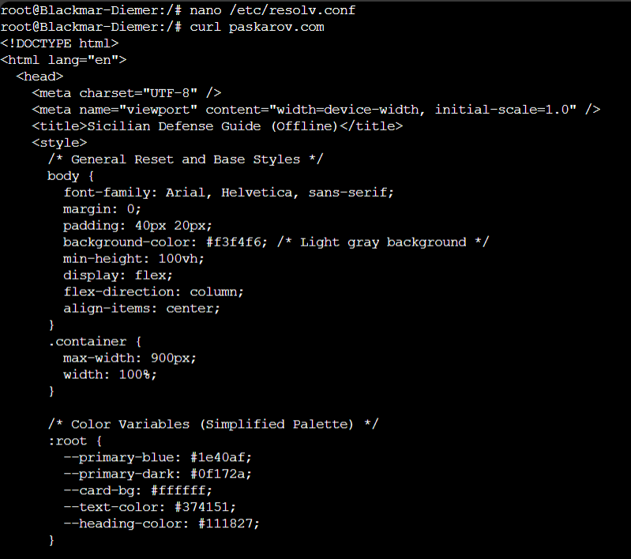

- Explanation

  Menyiapkan Sicilian sebagai Web-Server
  ```
  apt-get update
  apt-get install nginx
  ```
  Buat drektori baru pada `/var/www/`, dengan nama web
  ```
  mkdir /var/www/web
  ```
  Buat file HTML pada direktori `/var/www/web/`, kemudian isi dengan [HTML-File](https://drive.google.com/file/d/1eX0ZjRKprx8T34XFAssrpc7ZE1j6Jv0j/view)
  ```
  nano /var/www/web/halaman.html
  ```
  Buat file server block pada direktori `/etc/nginx/sites-available/` dengan nama web
  ```
  nano /etc/nginx/sites-available/web
  ```
  ```
  server {
      listen 80;
      server_name paskarov.com 10.3.1.235; 

      error_log /tmp/error.log;
      access_log /tmp/access.log; 

      root /var/www/web;
      index halaman.html;

      location / {
          try_files $uri $uri/ =404;
      }
  }
  ```
  Setelah selesai melakukan konfigurasi
  ```
  ln -s /etc/nginx/sites-available/web /etc/nginx/sites-enabled
  ```
  ```
  service nginx restart
  ```
  Untuk pengujian, pastikan dns server Client mengarah ke DNS-Server yang sedang menyala dan bisa lakukan
  ```
  curl paskarov.com
  ```

<br>

## Soal 8

> Buatlah custom access log ke file **/tmp/access.log.** Untuk keperluan logging, gunakan format log seperti di bawah:
> - Tanggal dan waktu akses dalam format standar log.
> - Nama node yang sedang diakses.
> - Alamat IP klien yang mengakses website.
> - Metode HTTP dan URI yang diakses oleh klien.
> - Status respons HTTP yang diberikan oleh server.
> - Jumlah byte yang dikirimkan dalam respons.
> - Waktu yang dihabiskan oleh server untuk menangani permintaan.> 
> - Contoh format log yang sesuai:  
[01/Oct/2024:11:30:45 +0000] Jarkom Node Sicilian Access from 192.168.1.15 using method "GET /resep/bayam HTTP/1.1" returned status 200 with 2567 bytes sent in 0.038 seconds

> _Webserver: Create a custom access log to the file **/tmp/access.log.** For logging purposes, use the log format shown below:_
> - _The date and time of access in standard log format._
> - _The name of the node being accessed._
> - _The IP address of the client accessing the website._
> - _The HTTP method and URI accessed by the client._
> - _The HTTP response status returned by the server._
> - _The number of bytes sent in the response._
> - _The time spent by the server processing the request._
> - _Example of appropriate log format:  
[01/Oct/2024:11:30:45 +0000] Jarkom Node Sicilian Access from 192.168.1.15 using method "GET /resep/bayam HTTP/1.1" returned status 200 with 2567 bytes sent in 0.038 seconds_

**Answer:**

- Screenshot

  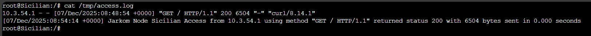

- Explanation

  Pada Web-Server Sicilian lakukan konfigurasi berikut
  ```
  nano /etc/nginx/nginx.conf
  ```
  ```
  tambahkan pada bagian logging

  log_format web_log '[$time_local] Jarkom Node $node_name Access from $remote_addr using method "$request" returned status $status with $body_bytes_sent bytes sent in $request_time seconds';

  untuk bagian log lainnya bisa di comment aja (error_log dan access_log)
  ```
  Edit juga server block
  ```
  nano /etc/nginx/sites-available/web
  ```
  ```
  server {
      listen 80;
      server_name paskarov.com 10.3.1.235; 
      set $node_name "Sicilian";

      error_log /tmp/error.log;
      access_log /tmp/access.log web_log; 

      root /var/www/web;
      index halaman.html;

      location / {
          try_files $uri $uri/ =404;
      }
  }
  ```
  Setelah selesai melakukan konfigurasi
  ```
  service nginx restart
  ```
  Untuk pengujian, pastikan dns server Client mengarah ke DNS-Server yang sedang menyala dan bisa lakukan
  ```
  curl paskarov.com
  ```
  Lakukan perintah berikut untuk melihat `access log` pada Web Server Sicilian
  ```
  cat /tmp/access.log
  ```

<br>

## Soal 9

> Konfigurasikan juga **Slav** agar berfungsi sebagai **web server nginx** yang menyajikan [halaman berikut](https://drive.google.com/file/d/1h8ik1Zcubntp0dvHt9NHYqSZLSTG6FuZ/view) dan **hanya** bisa diakses melalui port **8000** dan **8888.**

> _Configure **Slav** to function as an **nginx web server** that serves [this page](https://drive.google.com/file/d/1h8ik1Zcubntp0dvHt9NHYqSZLSTG6FuZ/view?usp=drive_link) and is **only** accessible via ports **8000** and **8888.**_

**Answer:**

- Screenshot

  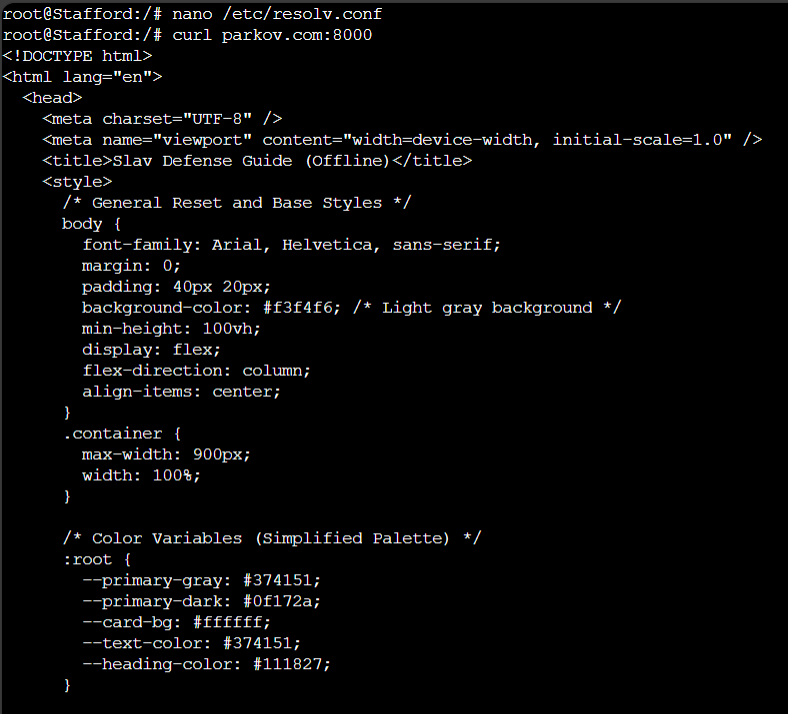

- Explanation

  Menyiapkan Slav sebagai Web-Server
  ```
  apt-get update
  apt-get install nginx
  ```
  Buat drektori baru pada `/var/www/`, dengan nama web
  ```
  mkdir /var/www/web
  ```
  Buat file HTML pada direktori `/var/www/web/`, kemudian isi dengan [HTML-File](https://drive.google.com/file/d/1h8ik1Zcubntp0dvHt9NHYqSZLSTG6FuZ/view)
  ```
  nano /var/www/web/halaman.html
  ```
  Buat file server block pada direktori `/etc/nginx/sites-available/` dengan nama web
  ```
  nano /etc/nginx/sites-available/web
  ```
  ```
  server {
      listen 8000;
      listen 8888;
      server_name parkov.com 10.3.2.215; 

      error_log /tmp/error.log;
      access_log /tmp/access.log; 

      root /var/www/web;
      index halaman.html;

      location / {
          try_files $uri $uri/ =404;
      }
  }
  ```
  Setelah selesai melakukan konfigurasi
  ```
  ln -s /etc/nginx/sites-available/web /etc/nginx/sites-enabled
  ```
  ```
  service nginx restart
  ```
  Untuk pengujian, pastikan dns server Client mengarah ke DNS-Server yang sedang menyala dan bisa lakukan
  ```
  curl parkov.com:8000
  curl parkov.com:8888
  ```

<br>

## Soal 10

> Untuk memudahkan akses, buatlah satu domain lagi dengan nama **openings.com** yang mengarah ke **Petrov.** Lalu, konfigurasikan juga **Petrov** sebagai **Reverse Proxy** yang akan melakukan forward request ke server yang sesuai berdasarkan URL profile yang diminta oleh klien dengan ketentuan sebagai berikut:
> - Request untuk “openings.com/**sicilian**” harus dialihkan ke web server **Sicilian.**
> - Request untuk “openings.com/**slav**” harus dialihkan ke web server **Slav.**

> _To facilitate access, create another domain with the name **openings.com** that points to **Petrov.** Then, configure **Petrov** as a **Reverse Proxy** that will forward requests to the appropriate server based on the profile URL requested by the client with the following conditions:_
> - _Requests for “openings.com/**sicilian**” must be forwarded to web server **Sicilian.**_
> - _Request for “openings.com/**slav**” must be forwarded to web server **Slav.**_

**Answer:**

- Screenshot

  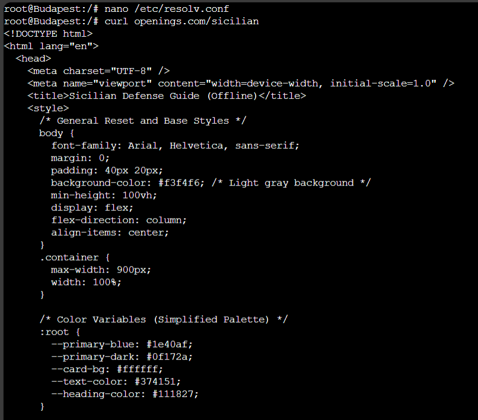

  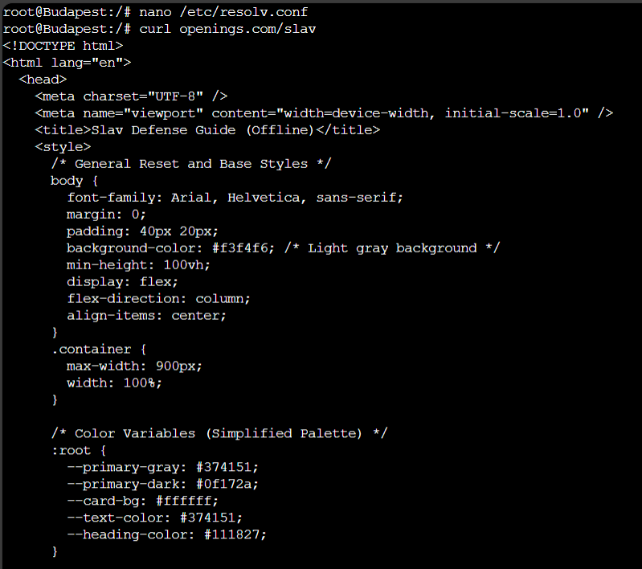

- Explanation

  Pada DNS Master kita tambahkan konfigurasi untuk `openings.com` serta Reverse DNS untuk Sicilian dan Slav
  ```
  nano /etc/bind/named.conf.local
  ```
  ```
  zone "openings.com" {
      type master;
      notify yes;
      also-notify { 10.3.1.29; };
      allow-transfer { 10.3.1.29; };
      file "/etc/bind/db.op";
  };

  zone "1.3.10.in-addr.arpa" {
      type master;
      notify yes;
      also-notify { 10.3.1.29; };
      allow-transfer { 10.3.1.29; };
      file "/etc/bind/db.10.3.1";
  };
  
  zone "2.3.10.in-addr.arpa" {
      type master;
      notify yes;
      also-notify { 10.3.1.29; };
      allow-transfer { 10.3.1.29; };
      file "/etc/bind/db.10.3.2";
  };
  ```
  Buat juga db-nya
  ```
  nano /etc/bind/db.op
  ```
  ```
  $TTL 604800
  @         IN    SOA    caro.openings.com. root.openings.com. (
                         2025102201         ; Serial
                         604800             ; Refresh
                         86400              ; Retry
                         2419200            ; Expire
                         604800 )           ; Negative Cache TTL
  ; 
  @         IN    NS     caro.openings.com.
  @         IN    NS     alekhine.openings.com.
  caro      IN    A      10.3.1.28
  alekhine  IN    A      10.3.1.29
  petrov    IN    A      10.3.1.11
  @         IN    A      10.3.1.11
  www       IN    CNAME  openings.com.
  ```
  ```
  nano /etc/bind/db.10.3.1
  ```
  ```
  $TTL 604800
  @                      IN    SOA    caro-kann.paskarov.com. root.paskarov.com. (
                                      2025102201         ; Serial
                                      604800             ; Refresh
                                      86400              ; Retry
                                      2419200            ; Expire
                                      604800 )           ; Negative Cache TTL
  ;
  @                      IN    NS     caro-kann.paskarov.com.
  @                      IN    NS     alekhine.paskarov.com.
  1.3.10.in-addr.arpa.   IN    NS     caro-kann.paskarov.com.
  235                    IN    PTR    paskarov.com.
  ```
  ```
  nano /etc/bind/db.10.3.2
  ```
  ```
  $TTL 604800
  @                      IN    SOA    caro-kann.parkov.com. root.parkov.com. (
                                      2025102201         ; Serial
                                      604800             ; Refresh
                                      86400              ; Retry
                                      2419200            ; Expire
                                      604800 )           ; Negative Cache TTL
  ;
  @                      IN    NS     caro-kann.parkov.com.
  @                      IN    NS     alekhine.parkov.com.
  2.3.10.in-addr.arpa.   IN    NS     caro-kann.parkov.com.
  215                    IN    PTR    parkov.com.
  ```
  Konfigurasikan juga pada DNS Slave Alekhine
  ```
  nano /etc/bind/named.conf.local
  ```
  ```
  zone "openings.com" {
      type slave;
      masters { 10.3.1.28; };
      file "db.op";
  };

  zone "1.3.10.in-addr.arpa" {
      type slave;
      masters { 10.3.1.28; };
      file "db.10.3.1";
  };
  
  zone "2.3.10.in-addr.arpa" {
      type slave;
      masters { 10.3.1.28; };
      file "db.10.3.2";
  };
  ```
  Setelah selesai melakukan konfigurasi pada DNS Master dan Slave, nyalakan lagi
  ```
  named -g
  ```
  Menyiapkan Petrov sebagai Reverse Proxy bagi Web Server
  ```
  apt-get update
  apt-get install nginx
  ```
  Buat file server block pada direktori `/etc/nginx/sites-available/` dengan nama op
  ```
  nano /etc/nginx/sites-available/op
  ```
  ```
  server {
      listen 80;
      server_name openings.com; 
    
      location /sicilian {
          proxy_pass http://10.3.1.235:80/; 
      }

      location /slav {
          proxy_pass http://10.3.2.215:8000/;
      }

      location / {
          try_files $uri $uri/ =404;
      }
  }
  ```
  Setelah selesai melakukan konfigurasi
  ```
  ln -s /etc/nginx/sites-available/op /etc/nginx/sites-enabled
  ```
  ```
  service nginx restart
  ```
  Untuk pengujian, pastikan dns server Client mengarah ke DNS-Server yang sedang menyala dan bisa lakukan
  ```
  curl openings.com/sicilian
  curl openings.com/slav
  ```

<br>

## Soal 11

> Tambahkan juga konfigurasi agar request untuk “openings.com/**random**” akan mengalihkan request ke webserver **Sicilian** dan **Slav** dengan algoritma _round-robin_.

> _Additionally, configure requests for "openings.com/**random**" to be redirected to the **Sicilian** and **Slav** web servers using a round-robin algorithm._

**Answer:**

- Screenshot

  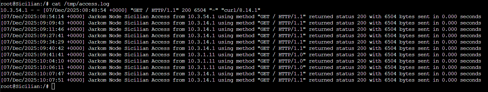

  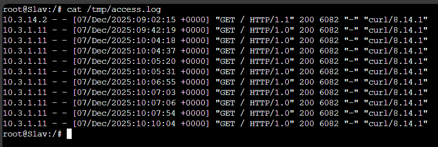

- Explanation

  Pada Reverse Proxy Petrov tambahkan algoritma round robin di file server block
  ```
  nano /etc/nginx/sites-available/op
  ```
  ```
  upstream info_backend_round_robin {
          server 10.3.1.235:80; 
          server 10.3.2.215:8000;
  }

  server {
      listen 80;
      server_name openings.com; 
    
      location /sicilian {
          proxy_pass http://10.3.1.235:80/; 
      }

      location /slav {
          proxy_pass http://10.3.2.215:8000/;
      }

      location / {
          proxy_pass http://info_backend_round_robin;
      }
  }
  ```
  Jalankan kembali
  ```
  service nginx restart
  ```
  Untuk pengujian, pastikan dns server Client mengarah ke DNS-Server yang sedang menyala dan bisa lakukan
  ```
  curl openings.com/makan
  curl openings.com/minum
  (sebanyak 3 kali masing-masing)
  ```
  Lakukan perintah berikut untuk melihat `access log` pada Web Server Sicilian dan Slav
  ```
  cat /tmp/access.log
  ```

<br>

## Soal 12

> Anatoly Parkov berencana untuk melakukan ekspansi secara besar-besaran. Maka dari itu, hapus seluruh konfigurasi Static Routing dan ubah agar seluruh router menggunakan Dynamic Routing. Gunakan protokol RIP!

> _Anatoly Parkov plans to perform a great expansion. Therefore, remove all Static Routing configurations and configure all routers to use Dynamic Routing. Use the RIP protocol!_

**Answer:**

- Screenshot

  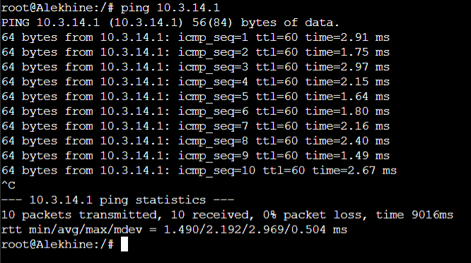

  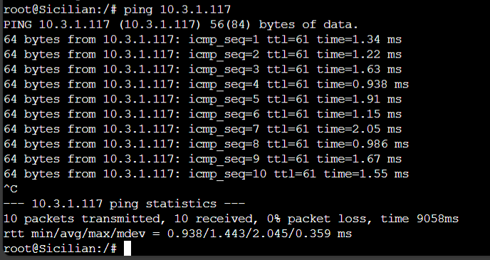

- Explanation

  Hapus semua pengaturan static routing yang ada pada router dengan perintah
  ```
  ip route del [subnet tujuan/netmask] via [gateway yang terhubung]
  ```
  Lakukan pengaturan pada semua router dengan menggunakan dynamic routing
  ```
  cd /usr/lib/frr
  ```
  Lalu nyalakan semua service yang diperlukan
  ```
  ./zebra -d
  ./ripd -d
  ./mgmtd -d
  ```
  Sekarang kita akan mengatur FRR di masing masing router
  ```
  vtysh
  ```
  Menjalankan command berikut di dalam `vtysh`
  ```
  conf t
  router rip
  ```
  Selanjutnya tambahkan network yang terhubung
  ```
  ## Router Lucena
  network 10.3.1.64/26
  network 10.3.1.32/29

  ## Router Zwischenzug
  network 10.3.1.8/29
  network 10.3.1.32/29

  ## Router Zugzwang
  network 10.3.1.128/25
  network 10.3.1.16/28
  network 10.3.2.0/24
  network 10.3.1.8/29

  ## Router Fianchetto
  network 10.3.1.32/29
  network 10.3.1.0/30

  ## Router Smith-Morra
  network 10.3.32.0/19
  network 10.3.8.0/21
  network 10.3.1.0/30
  default-information originate
  ```
  Untuk kembali ke tampilan semua bisa dengan command `exit`
  ```
  exit
  cd   --> untuk kembali ke direktori awal
  ```
  Untuk pengujian melakukan `ping` sama seperti no 2 namun dibalik, jadi dari Alekhine ke Budapest dan Sicilian ke Ponziani.

<br>

## Soal 13

> Untuk meningkatkan keamanan, konfigurasikan firewall **Smith-Morra** untuk melakukan pembatasan koneksi SSH ke server DNS. Drop semua packet SSH yang berasal dari seluruh client yang memiliki tujuan ke **Caro-Kann** atau **Alekhine.**

> _To increase security, configure the **Smith-Morra** firewall to restrict SSH connections to the **DNS server.** Drop all SSH packets from all clients destined for **Caro-Kann** or **Alekhine.**_

**Answer:**

- Screenshot

  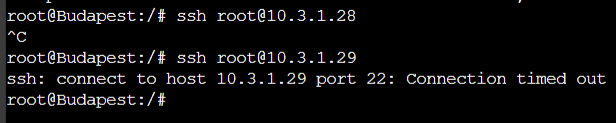

- Explanation

  Kita akan menerapkan firewall iptables
  ```
  ## Infomasi:
  Subnet Clent --> 10.3.8.0/21 dan 10.3.32.0/19
  IP Caro-Kann --> 10.3.1.28
  IP Alekhine  --> 10.3.1.29
  Port SSH     --> 22
  ```
  ```
  iptables -A FORWARD -p tcp --dport 22 -s 10.3.8.0/21 -d 10.3.1.28 -j DROP

  iptables -A FORWARD -p tcp --dport 22 -s 10.3.32.0/19 -d 10.3.1.28 -j DROP

  iptables -A FORWARD -p tcp --dport 22 -s 10.3.8.0/21 -d 10.3.1.29 -j DROP

  iptables -A FORWARD -p tcp --dport 22 -s 10.3.32.0/19 -d 10.3.1.29 -j DROP
  ```
  Setelah itu uji di Client
  ```
  ssh root@10.3.1.28
  ssh root@10.3.1.29
  ```
  Jika tidak menghasilkan apa-apa atau setelah lama menunggu menghasilkan Connection timed out maka semua paket berhasil di drop.

<br>

## Soal 14

> Nampaknya, web server juga manusia sehingga hanya ingin bekerja di hari kerja. Maka dari itu, semua client hanya bisa mengakses **Sicilian** dan **Slav** pada hari Senin-Jumat pada pukul 09:00-17:00.

> _Apparently, web servers are humans too, so they only want to work on weekdays. Therefore, all clients can only access **Sicilian** and **Slav** on Monday through Friday, 9:00 AM to 5:00 PM._

**Answer:**

- Screenshot

  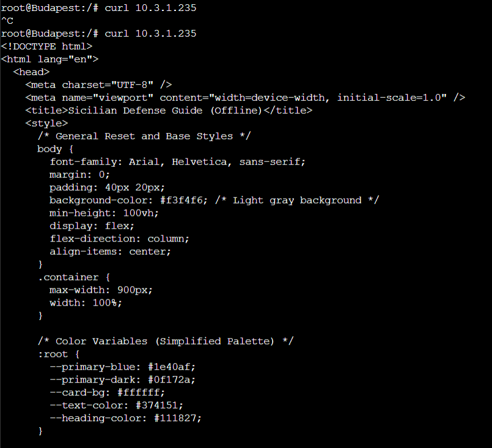

  Hasil yang pertama adalah ketika saya atur waktu pada `date -s "2025-12-07 14:00:00"`, kemudian hasil yang kedua ketika saya atur waktu pada `date -s "2025-12-08 10:00:00"`.

- Explanation

  Kita akan menerapkan firewall iptables pad roter Smith_moRRa yang terhubung dengan client
  ```
  ## Informasi
  Subnet Clent --> 10.3.8.0/21 dan 10.3.32.0/19
  IP Sicilian  --> 10.3.1.235
  IP Slav      --> 10.3.2.215
  Port Web     --> 80 (paskarov.com -- sicilian)      8000 (parkov.com -- slav)
  ```
  ```
  ## ACCEPT pada weekdays jam 9 sampai 17
  iptables -A FORWARD -p tcp -s 10.3.8.0/21 -d 10.3.1.235 -m multiport --dports 80,8000 -m time --weekdays Mon,Tue,Wed,Thu,Fri --timestart 09:00:00 --timestop 17:00:00 -j ACCEPT

  iptables -A FORWARD -p tcp -s 10.3.8.0/21 -d 10.3.2.215 -m multiport --dports 80,8000 -m time --weekdays Mon,Tue,Wed,Thu,Fri --timestart 09:00:00 --timestop 17:00:00 -j ACCEPT

  iptables -A FORWARD -p tcp -s 10.3.32.0/19 -d 10.3.1.235 -m multiport --dports 80,8000 -m time --weekdays Mon,Tue,Wed,Thu,Fri --timestart 09:00:00 --timestop 17:00:00 -j ACCEPT

  iptables -A FORWARD -p tcp -s 10.3.32.0/19 -d 10.3.2.215 -m multiport --dports 80,8000 -m time --weekdays Mon,Tue,Wed,Thu,Fri --timestart 09:00:00 --timestop 17:00:00 -j ACCEPT
  ```
  ```
  ## DROP selain waktu yang ditentukan
  iptables -A FORWARD -p tcp -s 10.3.8.0/21 -d 10.3.1.235 -m multiport --dports 80,8000 -j DROP
  
  iptables -A FORWARD -p tcp -s 10.3.8.0/21 -d 10.3.2.215 -m multiport --dports 80,8000 -j DROP

  iptables -A FORWARD -p tcp -s 10.3.32.0/19 -d 10.3.1.235 -m multiport --dports 80,8000 -j DROP
  
  iptables -A FORWARD -p tcp -s 10.3.32.0/19 -d 10.3.2.215 -m multiport --dports 80,8000 -j DROP
  ```
  Kemudian uji dari client dengan mengubah waktu pada router Smith Morra
  ```
  ## Router
  date -s "[tahun]-[bulan]-[tanggal] [jam]:[menit]:[detik]"
  contoh ==> date -s "2025-12-07 14:00:00"

  ## Client
  curl paskarov.com
  curl 10.3.1.235
  curl parkov.com:8000
  curl 10.3.2.215:8000
  ```

<br>

## Soal 15

> Terakhir, Gerry Paskarov berpesan untuk selalu melakukan logging, sehingga konfigurasikan fitur logging untuk melakukan log terhadap seluruh paket yang di-DROP pada firewall **Smith-Morra.**
> _Finally, Gerry Paskarov advises to always perform logging, so configure a logging feature to log all packets dropped on the **Smith-Morra** firewall._

**Answer:**

- Screenshot

  `Put your screenshot in here`

- Explanation

  `Put your explanation in here`

<br>
  
## Problems

## Revisions (if any)
