[](https://classroom.github.com/a/e_s827HM)
| Name           | NRP        | Kelas     |
| ---            | ---        | ----------|
| Wahid Badar Abiddin | 5025221025 | Kelas A |


## Put your topology config image here!

`Put image in here`

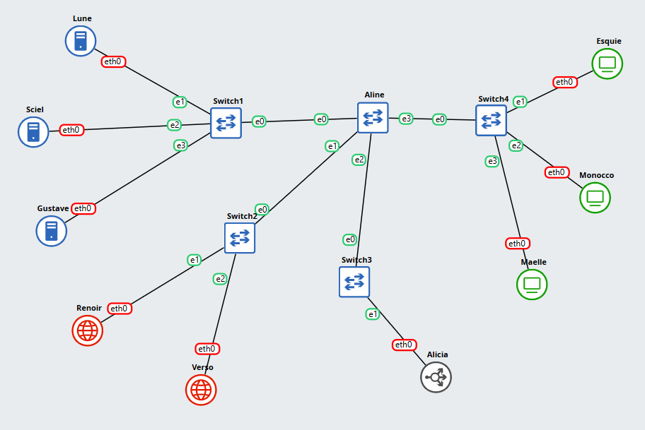

## Put your GNS3 Project file here!

`Put file URL here : `
https://github.com/Wbadara/Jarkom/tree/main/modul%203 

<br>

## Soal 1

> Setup Topo

> _Document the results of the subnet grouping that has been created._

**Answer:**

- Screenshot

  `Put your screenshot in here`
  
  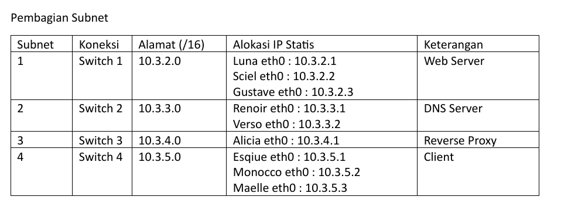

- Explanation

  `Put your explanation in here : `
  Pembagian subnet berdasarkan ketentuan yang udah ada, kemudian saya alokasikan IP statis yang mudah diingat.

<br>

## Soal 2

> Buatlah konfigurasi untuk domain 
> **lune33.com** → ke IP node Lune , 
> **sciel33.com** → ke IP node Sciel ,
> **gustave33.com** → ke IP node Gustave 
> pada DNS Master Renoir. Kemudian konfigurasikan node Verso sebagai DNS Slave yang bekerja untuk DNS Master Renoir.

> _Dns Configuration , on  the DNS Master (Renoir)_
> _lune33.com → IP of node Lune ,_
> _sciel33.com → IP of node Sciel ,_
> _gustave33.com → IP of node Gustave_
> _Configure Verso as the DNS Slave that works with DNS Master Renoir._

**Answer:**

- Screenshot

  `Put your screenshot in here`
  
  

- Explanation

  `Put your explanation in here : `
  Menyiapkan Renoir dan Verso sebagai DNS Server dengan melakukan perintah berikut pada node
  ```
  apt-get update
  apt-get install bind9 -y
  ```
  Setelah itu, lakukan pengaturan pada DNS Master Renoir.
  ```
  nano /etc/bind/named.conf.local
  ```
  ```
  zone "lune33.com" {
      type master;
      notify yes;
      also-notify { 10.3.3.2; }; // Verso (DNS Slave)
      allow-transfer { 10.3.3.2; }; // Verso (DNS Slave)
      file "/etc/bind/db.lune33";
  };

  zone "sciel33.com" {
      type master;
      notify yes;
      also-notify { 10.3.3.2; }; // Verso (DNS Slave)
      allow-transfer { 10.3.3.2; }; // Verso (DNS Slave)
      file "/etc/bind/db.sciel33";
  };

  zone "gustave33.com" {
      type master;
      notify yes;
      also-notify { 10.3.3.2; }; // Verso (DNS Slave)
      allow-transfer { 10.3.3.2; }; // Verso (DNS Slave)
      file "/etc/bind/db.gustave33";
  };
  ```
  ```
  nano /etc/bind/db.lune33
  nano /etc/bind/db.sciel33
  nano /etc/bind/db.gustave33
  ```
  ```
  $TTL 604800
  @         IN    SOA    renoir.lune33.com. root.lune33.com. (
                         2025102201         ; Serial
                         604800             ; Refresh
                         86400              ; Retry
                         2419200            ; Expire
                         604800 )           ; Negative Cache TTL
  ; 
  @         IN    NS     renoir.lune33.com.
  @         IN    NS     verso.lune33.com. 
  renoir    IN    A      10.3.3.1
  verso     IN    A      10.3.3.2
  lune      IN    A      10.3.2.1
  @         IN    A      10.3.2.1


  $TTL 604800
  @         IN    SOA    renoir.sciel33.com. root.sciel33.com. (
                         2025102201          ; Serial
                         604800              ; Refresh
                         86400               ; Retry
                         2419200             ; Expire
                         604800 )            ; Negative Cache TTL
  ; 
  @         IN    NS     renoir.sciel33.com.
  @         IN    NS     verso.sciel33.com. 
  renoir    IN    A      10.3.3.1
  verso     IN    A      10.3.3.2
  sciel     IN    A      10.3.2.2
  @         IN    A      10.3.2.2


  $TTL 604800
  @         IN    SOA    renoir.gustave33.com. root.gustave33.com. (
                         2025102201            ; Serial
                         604800                ; Refresh
                         86400                 ; Retry
                         2419200               ; Expire
                         604800 )              ; Negative Cache TTL
  ; 
  @         IN    NS     renoir.gustave33.com.
  @         IN    NS     verso.gustave33.com. 
  renoir    IN    A      10.3.3.1
  verso     IN    A      10.3.3.2
  gustave   IN    A      10.3.2.3
  @         IN    A      10.3.2.3

  ```

  Lakukan pengaturan pada Verso sebagai DNS Slave dari Renoir.
  ```
  nano /etc/bind/named.conf.local
  ```
  ```
  zone "lune33.com" {
      type slave;
      masters { 10.3.3.1; }; // Renoir (DNS Master)
      file "db.lune33";
  };

  zone "sciel33.com" {
      type slave;
      masters { 10.3.3.1; }; // Renoir (DNS Master)
      file "db.sciel33";
  };

  zone "gustave33.com" {
      type slave;
      masters { 10.3.3.1; }; // Renoir (DNS Master)
      file "db.gustave33";
  };
  ```
  
  Setelah selesai melakukan pengaturan pada Renoir dan Verso, sekarang kita jalankan server DNS pada Renoir dan Verso dengan perintah
  ```
  named -g
  ```
  DNS Server berhasil berjalan jika terdapat baris sebagai berikut
  ```
  ... zone lune33.com/IN: loaded serial 2025102201
  ... zone lune33.com/IN: snding notifies (serial 2025102201)
  ... zone sciel33.com/IN: loaded serial 2025102201
  ... zone sciel33.com/IN: snding notifies (serial 2025102201)
  ... zone gustave33.com/IN: loaded serial 2025102201
  ... zone gustave33.com/IN: snding notifies (serial 2025102201)
  ```

  Setelah berhasil, sekarang waktunya tes di client Maelle dengan melakukan perintah
  ```
  nano /etc/resolv.conf
  ```
  ```
  nameserver 10.3.3.1
  nameserver 10.3.3.2
  ```
  Kemudian lakukan ping
  ```
  ping lune33.com -c 5
  ping sciel33.com -c 5
  ping gustave33.com -c 5
  ```

<br>

## Soal 3

> Tambahkan subdomain alias berupa exp.lune33.com yang mengarah ke alamat lune33.com dan exp.sciel33.com yang mengarah ke alamat sciel33.com (HINT: CNAME). Selain itu, tambahkan konfigurasi untuk melakukan reverse DNS lookup untuk domain gustave33.com

> _Subdomain Configuration,_ 
> _Add alias subdomains (HINT: CNAME)._
> _exp.lune33.com → alias to lune33.com_
> _exp.sciel33.com → alias to sciel33.com_
> _Also, configure reverse DNS lookup for the domain gustave33.com._

**Answer:**

- Screenshot

  `Put your screenshot in here`
  
  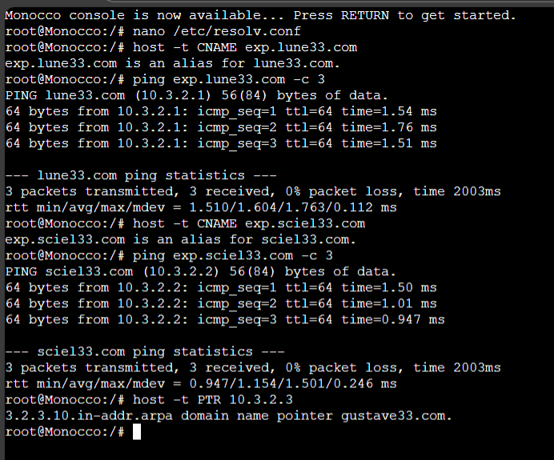

- Explanation

  `Put your explanation in here : `
  Pada DNS Master Renoir lakukan pengaturan sebagai berikut
  ```
  nano /etc/bind/named.conf.local
  ```
  ```
  tambahkan :
  zone "3.10.in-addr.arpa" {
      type master;
      notify yes;
      also-notify { 10.3.3.2; }; // Verso (DNS Slave)
      allow-transfer { 10.3.3.2; }; // Verso (DNS Slave)
      file "/etc/bind/db.10.3";
  };
  ```
  note : hanya 2 byte pertama dari IP Gustave yang dibalik urutan penulisannya karena memakai netmask /16 (255.255.0.0) jika memakai netmask /24 (255.255.255.0) maka yang dibalik urutan penulisannya adalah 3 byte pertama.
  ```
  nano /etc/bind/db.10.3
  ```
  ```
  $TTL 604800
  @                    IN    SOA    renoir.gustave33.com. root.gustave33.com. (
                                    2025102201            ; Serial 
                                    604800                ; Refresh
                                    86400                 ; Retry
                                    2419200               ; Expire
                                    604800 )              ; Negative Cache TTL
  ;
  @                    IN    NS     renoir.gustave33.com.
  @                    IN    NS     verso.gustave33.com.
  3.10.in-addr.arpa.   IN    NS     renoir.gustave33.com.
  3.2                  IN    PTR    gustave33.com.
  2.2                  IN    PTR    sciel33.com.
  1.2                  IN    PTR    lune33.com.
  ```
  ```
  nano /etc/bind/db.lune33
  nano /etc/bind/db.sciel33
  ```
  ```
  tambahkan pada db.lune33
  exp       IN    CNAME  lune33.com.

  tambahkan pada db.sciel33
  exp       IN    CNAME  sciel33.com.
  ```

  Pada DNS Slave Verso lakukan pengaturan sebagai berikut
  ```
  nano /etc/bind/named.conf.local
  ```
  ```
  tambahkan :
  zone "3.10.in-addr.arpa" {
      type slave;
      masters { 10.3.3.1; }; // Renoir (DNS Master)
      file "db.10.3";
  };
  ```

  Setelah selesai melakukan pengaturan pada Renoir dan Verso, sekarang kita jalankan server DNS pada Renoir dan Verso dengan perintah
  ```
  named -g
  ```
  DNS Server berhasil berjalan jika terdapat baris sebagai berikut
  ```
  ... zone lune33.com/IN: loaded serial 2025102201
  ... zone lune33.com/IN: sending notifies (serial 2025102201)
  ... zone sciel33.com/IN: loaded serial 2025102201
  ... zone sciel33.com/IN: sending notifies (serial 2025102201)
  ... zone gustave33.com/IN: loaded serial 2025102201
  ... zone gustave33.com/IN: sending notifies (serial 2025102201)
  ... zone 3.10.in-addr.arpa/IN: loaded serial 2025102201
  ... zone 3.10.in-addr.arpa/IN: sending notifies (serial 2025102201)
  ```

  Setelah berhasil, sekarang waktunya tes di client Monocco dengan melakukan perintah
  ```
  nano /etc/resolv.conf
  ```
  ```
  nameserver 10.3.3.1
  nameserver 10.3.3.2
  ```
  Kemudian lakukan tes
  ```
  host -t CNAME exp.lune33.com
  ping exp.lune33.com -c 3
  host -t CNAME exp.sciel33.com
  ping exp.sciel33.com -c 3
  host -t PTR 10.3.2.3
  ```
  
<br>

## Soal 4

> Buatlah subdomain berupa expedition.gustave33.com dan delegasikan subdomain tersebut dari Renoir ke Verso dengan alamat IP tujuan adalah node Gustave. Kemudian, matikan Renoir dan coba lakukan ping ke semua domain dan subdomain yang telah dikonfigurasikan pada nomor 2, 3, dan 4.

> _Create a subdomain expedition.gustave33.com and delegate it from Renoir to Verso, with the target IP being node Gustave.Then, turn off Renoir and try pinging all domains and subdomains configured in tasks 2, 3, and 4 to verify delegation works correctly._

**Answer:**

- Screenshot

  `Put your screenshot in here`
  
  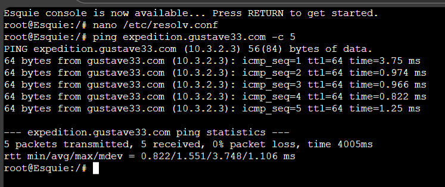
  
  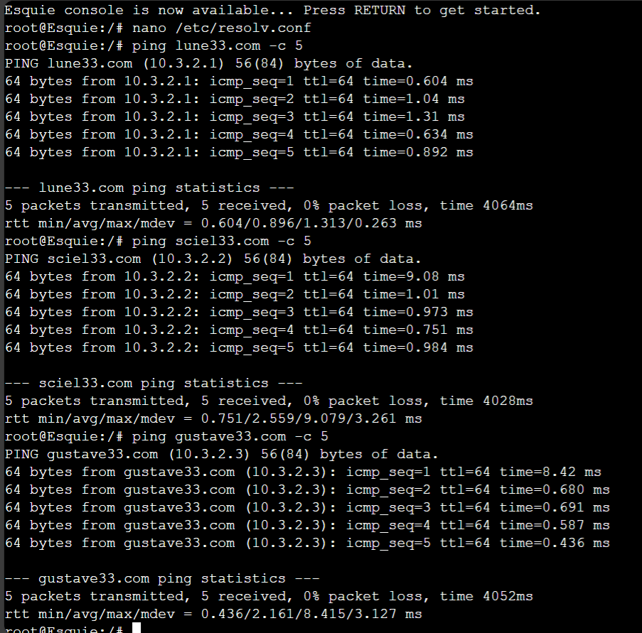
  
  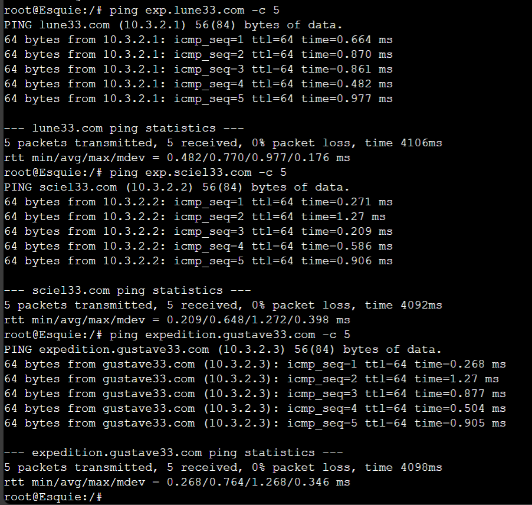

- Explanation

  `Put your explanation in here : `
  Delegasi berarti Renoir memberitahu klien bahwa untuk `expedition.gustave33.com`, mereka harus bertanya ke Verso.
  Pada DNS Master Renoir lakukan pengaturan sebagai berikut
  ```
  nano /etc/bind/db.gustave33
  ```
  ```
  tambahkan :
  expedition IN    NS     verso.gustave33.com.
  ```

  Pada DNS Slave Verso lakukan pengaturan sebagai berikut
  ```
  nano /etc/bind/named.conf.local
  ```
  ```
  tambahkan :
  zone "expedition.gustave33.com" {
      type master;
      file "/etc/bind/db.expedition.gustave33";
  };
  ```
  ```
  nano /etc/bind/db.expedition.gustave33
  ```
  ```
  $TTL 604800
  @    IN    SOA    verso.gustave33.com. root.expedition.gustave33.com. (
                    2025102201           ; Serial
                    604800               ; Refresh
                    86400                ; Retry
                    2419200              ; Expire
                    604800 )             ; Negative Cache TTL

  ; 
  @    IN    NS     verso.gustave33.com. 
  @    IN    A      10.3.2.3
  ```

  Setelah selesai melakukan pengaturan pada Renoir dan Verso, sekarang kita jalankan server DNS pada Renoir dan Verso dengan perintah
  ```
  named -g
  ```
  DNS Server berhasil berjalan jika terdapat baris sebagai berikut
  ```
  ... zone lune33.com/IN: loaded serial 2025102201
  ... zone lune33.com/IN: sending notifies (serial 2025102201)
  ... zone sciel33.com/IN: loaded serial 2025102201
  ... zone sciel33.com/IN: sending notifies (serial 2025102201)
  ... zone gustave33.com/IN: loaded serial 2025102201
  ... zone gustave33.com/IN: sending notifies (serial 2025102201)
  ... zone 3.10.in-addr.arpa/IN: loaded serial 2025102201
  ... zone 3.10.in-addr.arpa/IN: sending notifies (serial 2025102201)
  ```

  Setelah berhasil, sekarang waktunya tes di client Esquie dengan melakukan perintah
  ```
  nano /etc/resolv.conf
  ```
  ```
  nameserver 10.3.3.1
  nameserver 10.3.3.2
  ```
  Kemudian lakukan tes
  ```
  ping expedition.gustave33.com -c 5
  ```

  Sekarang lanjut pengujian DNS Slave Verso dengan mematikan DNS Master Renoir. Untuk mematikan `named -g` bisa menggunakan `ctrl+C`.
  Setelah DNS Master renoir dimatikan, kita ubah pengaturan pada client Esquie sebagai berikut
  ```
  nano /etc/resolv.conf
  ```
  ```
  nameserver 10.3.3.2
  ```
  Kemudian lakukan tes
  ```
  ping lune33.com -c 5
  ping sciel33.com -c 5
  ping gustave33.com -c 5
  ping exp.lune33.com -c 5
  ping exp.sciel33.com -c 5
  ping expedition.gustave33.com -c 5
  ```

<br>

## Soal 5

> Konfigurasi node Lune, Sciel, dan Gustave agar berfungsi sebagai web server Nginx yang akan menyajikan halaman profil, dimana halaman profil akan berbeda untuk setiap node. Dari folder berikut, gunakan profile_lune.html untuk menyajikan halaman profil di node Lune, profile_sciel.html untuk menyajikan halaman profil di node Sciel, dan profile_gustave.html untuk menyajikan halaman profil di node Gustave. Konfigurasikan Nginx di setiap node untuk menyimpan custom access log ke file /tmp/access.log dan error log ke file /tmp/error.log. 

> _Configure Lune, Sciel, and Gustave as Nginx web servers serving profile pages, where each node has a unique profile page:_
> _- Use profile_lune.html for Lune_
> _- Use profile_sciel.html for Sciel_
> _- Use profile_gustave.html for Gustave_
> _In each web server, Configure Nginx to store custom logs:_
> _- Access log: /tmp/access.log_
> _- Error log: /tmp/error.log_

**Answer:**

- Screenshot

  `Put your screenshot in here`

  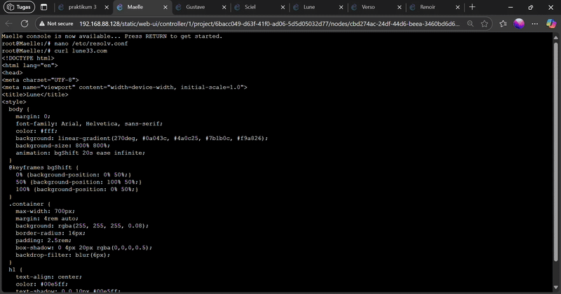

  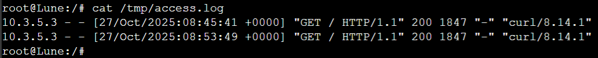

  

  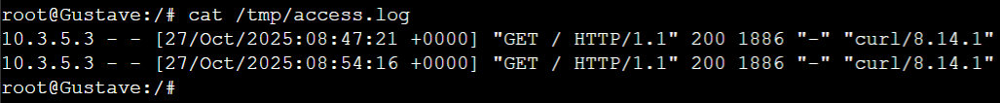

- Explanation

  `Put your explanation in here : `
  Pada node Lune, Sciel dan Gustave lakukan konfigurasi berikut
  ```
  apt-get update
  apt-get install nginx
  ```
  Buat drektori baru pada `/var/www/`, dengan nama web
  ```
  mkdir /var/www/web
  ```
  Buat file HTML pada direktori `/var/www/web/`, kemudian isi dengan file HTML yang diberikan
  ```
  node Lune
  nano /var/www/web/profile_lune.html

  node Sciel
  nano /var/www/web/profile_sciel.html

  node Gustave
  nano /var/www/web/profile_gustave.html
  ```
  File HTML https://drive.google.com/drive/folders/1A6_IelWIX90PY33oPIM3jHuS9QmBnXft
  
  Pada setiap node, buat file server block pada direktori `/etc/nginx/sites-available/` dengan nama web
  ```
  nano /etc/nginx/sites-available/web
  ```
  ```
  node Lune
  server {
      listen 80;
      server_name lune33.com 10.3.2.1; 

      error_log /tmp/error.log;
      access_log /tmp/access.log; 

      root /var/www/web;
      index profile_lune.html;

      location / {
          try_files $uri $uri/ =404;
      }
  }

  node Sciel
  server {
      listen 80;
      server_name sciel33.com 10.3.2.2; 

      error_log /tmp/error.log;
      access_log /tmp/access.log;

      root /var/www/web;
      index profile_sciel.html;

      location / {
          try_files $uri $uri/ =404;
      }
  }

  node Gustave
  server {
      listen 80;
      server_name gustave33.com 10.3.2.3; 

      error_log /tmp/error.log;
      access_log /tmp/access.log; 

      root /var/www/web;
      index profile_gustave.html;

      location / {
          try_files $uri $uri/ =404;
      }
  }
  ```
  Setelah selesai melakukan konfigurasi pada node Lune, Sciel dan Gustave
  ```
  ln -s /etc/nginx/sites-available/web /etc/nginx/sites-enabled
  ```
  ```
  service nginx restart
  ```

  Setelah berhasil berjalan, sekarang waktunya tes di client Maelle. Pastikan DNS Server menyala dan konfigurasi client di `/etc/resolv.conf` sudah benar
  ```
  curl lune33.com
  curl sciel33.com
  curl gustave33.com
  ```
  Kemudian balik ke node Web Server, lakukan perintah berikut untuk melihat `access log`
  ```
  cat /tmp/access.log
  ```

<br>

## Soal 6

> Setelah website berhasil dideploy pada masing-masing node web server dan halaman dapat menampilkan profil yang sesuai,  buatlah custom access log ke file /tmp/access.log di masing-masing node web server menggunakan format log tertentu seperti di bawah:
> - Tanggal dan waktu akses dalam format standar log.
> - Nama node yang sedang diakses.
> - Alamat IP klien yang mengakses website.
> - Metode HTTP dan URI yang diakses oleh klien.
> - Status respons HTTP yang diberikan oleh server.
> - Jumlah byte yang dikirimkan dalam respons.
> - Waktu yang dihabiskan oleh server untuk menangani permintaan.
> - Contoh format log yang sesuai:
>   [01/Oct/2024:11:30:45 +0000] Jarkom Node Lune Access from 192.168.1.15 using method "GET /resep/bayam HTTP/1.1" returned status 200 with 2567 bytes sent in 0.038 seconds

> _After successfully deploying each website and verifying the correct profile page is displayed, create a custom access log in /tmp/access.log on each web server using the following format:_
> _- Date and time of access (standard log format)_
> _- Name of the node being accessed_
> _- IP address of the client accessing the website_
> _- HTTP method and URI accessed by the client_
> _- HTTP response status code_
> _- Number of bytes sent in the response_
> _- Time taken by the server to process the request_
> _- Example Log Format:_
> _[01/Oct/2024:11:30:45 +0000] Jarkom Node Lune Access from 192.168.1.15 using method "GET /resep/bayam HTTP/1.1" returned status 200 with 2567 bytes sent in 0.038 seconds_

**Answer:**

- Screenshot

  `Put your screenshot in here`

  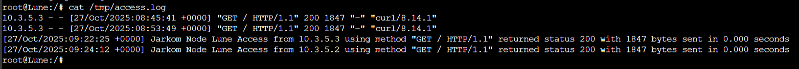

  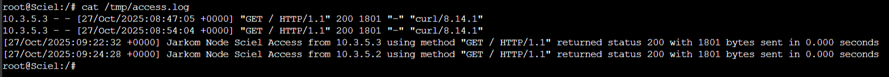

  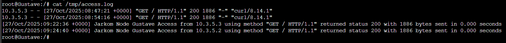

- Explanation

  `Put your explanation in here : `
  Pada node Lune, Sciel dan Gustave lakukan konfigurasi berikut
  ```
  nano /etc/nginx/nginx.conf
  ```
  ```
  tambahkan pada bagian logging

  log_format web_log '[$time_local] Jarkom Node $node_name Access from $remote_addr using method "$request" returned status $status with $body_bytes_sent bytes sent in $request_time seconds';

  untuk bagian log lainnya bisa di comment aja (error_log dan access_log)
  ```
  Edit juga server block pada masing-masing node
  ```
  nano /etc/nginx/sites-available/web
  ```
  ```
  tambahkan
  node Lune
  set $node_name "Lune";
  access_log /tmp/access.log web_log;

  node Sciel
  set $node_name "Sciel";
  access_log /tmp/access.log web_log;

  node Gustave
  set $node_name "Gustave";
  access_log /tmp/access.log web_log;
  ```

  Setelah selesai melakukan konfigurasi pada node Lune, Sciel dan Gustave
  ```
  service nginx restart
  ```
  
  Setelah berhasil berjalan, sekarang waktunya tes di client Maelle dan Monocco. Pastikan DNS Server menyala dan konfigurasi client di `/etc/resolv.conf` sudah benar
  ```
  curl lune33.com
  curl sciel33.com
  curl gustave33.com
  ```
  Kemudian balik ke node Web Server, lakukan perintah berikut untuk melihat `access log`
  ```
  cat /tmp/access.log
  ```

<br>

## Soal 7

> Gustave merupakan web server yang tidak disarankan untuk dilihat oleh publik. Maka dari itu, ubahlah konfigurasi nginx sehingga halaman profil Gustave menjadi hanya bisa di akses melalui port 8080 dan 8888.

> _The Gustave web server should not be publicly accessible.
Modify the Nginx configuration so that Gustave’s profile page can only be accessed through ports 8080 and 8888._

**Answer:**

- Screenshot

  `Put your screenshot in here`

  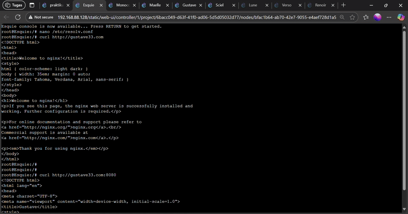

- Explanation

  `Put your explanation in here : `
  Pada node Gustave lakukan pengaturan berikut
  ```
  nano /etc/nginx/sites-available/web
  ```
  ```
  ubah bagian listen menjadi

  listen 8080;
  listen 8888;
  ```

  Setelah selesai melakukan konfigurasi pada node Gustave
  ```
  service nginx restart
  ```
  
  Setelah berhasil berjalan, sekarang waktunya tes di client Esquie. Pastikan DNS Server menyala dan konfigurasi client di `/etc/resolv.conf` sudah benar
  ```
  curl gustave33.com
  curl gustave33.com:8080
  curl gustave33.com:8888
  ```

<br>

## Soal 8

> Untuk mempermudah program ekspedisi, maka node Lune, Sciel, Gustave sepakat untuk membuat halaman informasi dengan konten yang sama. Maka dari itu, buatlah lagi 1 server block di dalam konfigurasi nginx yang akan menyajikan file HTML ini. Namun, mereka ingin menyajikan halaman informasi tersebut di port yang berbeda-beda, yaitu Lune menggunakan port 8000, Sciel menggunakan port 8100, dan Gustave menggunakan port 8200.

> _To simplify coordination for the expedition program, Lune, Sciel, and Gustave agree to create a shared information page with the same content. Add one more server block in each node’s Nginx configuration that serves this HTML file 
Each node should serve the information page on a different port:_
> _- Lune → port 8000_
> _- Sciel → port 8100_
> _- Gustave → port 8200_

**Answer:**

- Screenshot

  `Put your screenshot in here`

  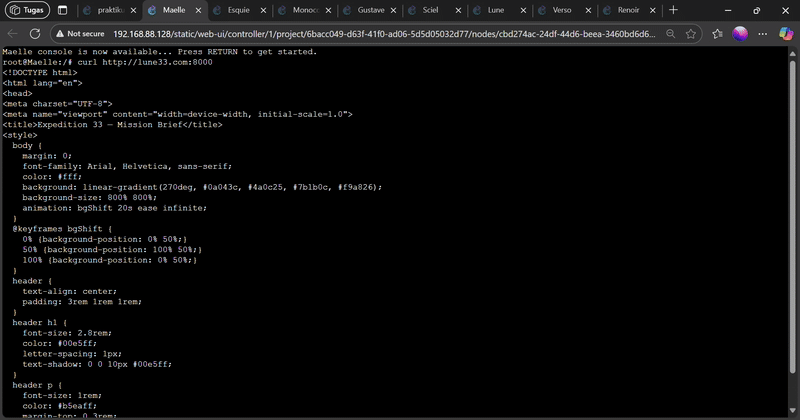

- Explanation

  `Put your explanation in here : `
  Pada node Lune, Sciel dan Gustave buat file HTML pada direktori `/var/www/web/`, kemudian isi dengan file HTML yang diberikan
  ```
  nano /var/www/web/profile_info.html
  ```
  File HTML https://drive.google.com/file/d/1BLg3S22ldhL-wRYN-ivowEqh8cYwwfVS/view?usp=sharing

  Kemudian tambahkan server block di file `/etc/nginx/sites-available/web` pada masing-masing node
  ```
  nano /etc/nginx/sites-available/web
  ```
  ```
  node Lune
  server {
      listen 8000;
      server_name lune33.com 10.3.2.1;
      set $node_name "Lune";
  
      access_log /tmp/access.log web_log;
      error_log /tmp/error.log;

      root /var/www/web;
      index profile_info.html;

      location / {
          try_files $uri $uri/ =404;
      }
  }

  node Sciel
  server {
      listen 8100;
      server_name sciel33.com 10.3.2.2; 
      set $node_name "Sciel";
  
      access_log /tmp/access.log web_log;
      error_log /tmp/error.log;

      root /var/www/web;
      index profile_info.html;

      location / {
          try_files $uri $uri/ =404;
      }
  }

  node Gustave
  server {
      listen 8200;
      server_name gustave33.com 10.3.2.3; 
      set $node_name "Gustave";
  
      access_log /tmp/access.log web_log;
      error_log /tmp/error.log;

      root /var/www/web;
      index profile_info.html;

      location / {
          try_files $uri $uri/ =404;
      }
  }
  ```
  
  Setelah selesai melakukan konfigurasi pada node Lune, Sciel dan Gustave
  ```
  service nginx restart
  ```
  
  Setelah berhasil berjalan, sekarang waktunya tes di client Maelle. Pastikan DNS Server menyala dan konfigurasi client di `/etc/resolv.conf` sudah benar
  ```
  curl lune33.com:8000
  curl sciel33.com:8100
  curl gustave33.com:8200
  ```
  

<br>

## Soal 9

> Untuk mempermudah akses ke profil tiap anggota ekspedisi, buatlah 1 domain lagi yaitu "expeditioners.com" yang akan mengarah ke Alicia. Lalu, untuk mencegah overload dari salah satu web server, konfigurasikan reverse proxy Alicia agar bisa forward request ke server yang sesuai berdasarkan URL profile yang diminta oleh klien dengan ketentuan sebagai berikut:
> -  Request untuk “expeditioners.com/profil_lune” harus dialihkan ke halaman profil web server Lune.
> -  Request untuk “expeditioners.com/profil_sciel” harus dialihkan ke halaman profil web server Sciel.
> -  Request untuk “expeditioners.com/profil_gustave” harus dialihkan ke halaman profil web server Gustave.
> Jika terdapat request ke URL selain profil yang ditentukan, reverse proxy akan mengalihkan ke halaman informasi pada web server Lune.

> _To make it easier to access each member’s profile, create a new domain “expeditioners.com” that points to Alicia. "
Configure Alicia’s reverse proxy (Nginx) to forward requests to the correct web server based on the requested URL, with the following rules:_
> _- Request URL expeditioners.com/profil_lune, Forward To Lune’s profile page_
> _- Request URL expeditioners.com/profil_sciel, Forward To Sciel’s profile page_
> _- Request URL expeditioners.com/profil_gustave, Forward To Gustave’s profile page_
> _- Any other URL, Forward To Lune’s information page_

**Answer:**

- Screenshot

  `Put your screenshot in here`

  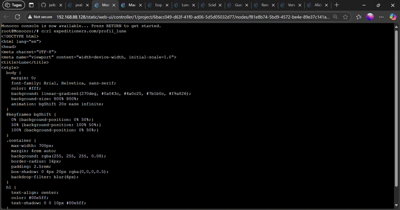

- Explanation

  `Put your explanation in here : `
  Pada DNS Master Renoir tambahkan zone untuk domain `expeditioners.com`
  ```
  nano /etc/bind/named.conf.local
  ```
  ```
  tambahkan :
  zone "expeditioners.com" {
      type master;
      notify yes;
      also-notify { 10.3.3.2; }; // Verso (DNS Slave)
      allow-transfer { 10.3.3.2; }; // Verso (DNS Slave)
      file "/etc/bind/db.exp";
  };
  ```
  ```
  nano /etc/bind/db.exp
  ```
  ```
  $TTL 604800
  @         IN    SOA    renoir.expeditioners.com. root.expeditioners.com. (
                         2025102201                ; Serial
                         604800                    ; Refresh
                         86400                     ; Retry
                         2419200                   ; Expire
                         604800 )                  ; Negative Cache TTL
  ; 
  @         IN    NS     renoir.expeditioners.com.
  @         IN    NS     verso.expeditioners.com. 
  renoir    IN    A      10.3.3.1
  verso     IN    A      10.3.3.2
  alicia    IN    A      10.3.4.1
  @         IN    A      10.3.4.1
  ```
  Pada DNS Slave Verso
  ```
  nano /etc/bind/named.conf.local
  ```
  ```
  tambahkan :
  zone "expeditioners.com" {
      type slave;
      masters { 10.3.3.1; }; // Renoir (DNS Master)
      file "db.exp";
  };
  ```
  Setelah selesai melakukan pengaturan pada Renoir dan Verso, sekarang kita jalankan server DNS pada Renoir dan Verso dengan perintah
  ```
  named -g
  ```

  Kemudian lanjut ke reverse proxy Alicia untuk melakukan konfigurasi
  ```
  nano /etc/nginx/sites-available/exp
  ```
  ```
  server {
      listen 80;
      server_name expeditioners.com;

      location /profil_lune {
          proxy_pass http://10.3.2.1:80/; 
      }

      location /profil_sciel {
          proxy_pass http://10.3.2.2:80/;
      }

      location /profil_gustave {
          proxy_pass http://10.3.2.3:8888/; 
      }

      location / {
          proxy_pass http://10.3.2.1:8000/; 
      }
  }
  ```
  Setelah selesai melakukan konfigurasi pada node Alicia
  ```
  ln -s /etc/nginx/sites-available/exp /etc/nginx/sites-enabled
  ```
  ```
  service nginx restart
  ```

  Setelah berhasil berjalan, sekarang waktunya tes di client Monocco. Pastikan DNS Server menyala dan konfigurasi client di `/etc/resolv.conf` sudah benar
  ```
  curl expeditioners.com/profil_lune
  curl expeditioners.com/profil_sciel
  curl expeditioners.com/profil_gustave
  curl expeditioners.com
  ``` 

<br>

## Soal 10

> Untuk mendistribusikan traffic halaman informasi, atur Reverse Proxy Alicia agar dapat membagi pekerjaan kepada web server Lune, Sciel, dan Gustave secara optimal menggunakan algoritma Round-robin. Pastikan target pembagian load merupakan halaman informasi, bukan halaman profil masing-masing web server.

> _To distribute traffic for the information page, configure the reverse proxy (Alicia) to use Round-robin load balancing between the three web servers: Lune, Sciel, and Gustave.
Ensure that only the information page is included in the load-balancing configuration - not the profile pages._

**Answer:**

- Screenshot

  `Put your screenshot in here`

  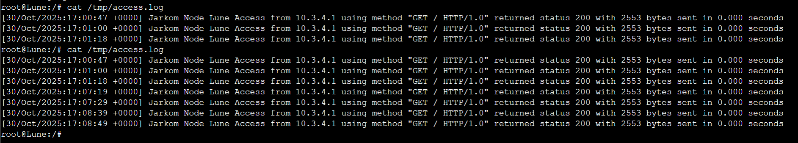

  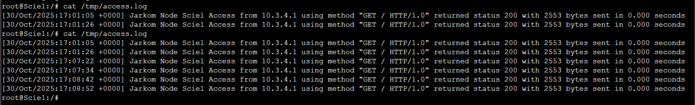

  

- Explanation

  `Put your explanation in here : `
  Pada Reverse Proxy Alicia tambahkan algoritma Round-robin
  ```
  nano /etc/nginx/sites-available/exp
  ```
  ```
  tambahkan diatas bagian server 
  upstream info_backend_round_robin {
          server 10.3.2.1:8000; 
          server 10.3.2.2:8100;
          server 10.3.2.3:8200; 
  }

  kemudian ubah bagian location / {} menjadi
  proxy_pass http://info_backend_round_robin;
  ```
  Setelah selesai melakukan konfigurasi pada node Alicia
  ```
  service nginx restart
  ```

  Setelah berhasil berjalan, sekarang waktunya tes di client Esquie, Monocco dan Maelle. Pastikan DNS Server menyala dan konfigurasi client di `/etc/resolv.conf` sudah benar
  ```
  curl expeditioners.com
  sebanyak 6 kali
  ```
  Kemudian balik ke node Web Server, lakukan perintah berikut untuk melihat `access log` untuk melihat apakah pembagian load berhasil
  ```
  cat /tmp/access.log
  ```  

<br>
  
## Problems

## Revisions (if any)
