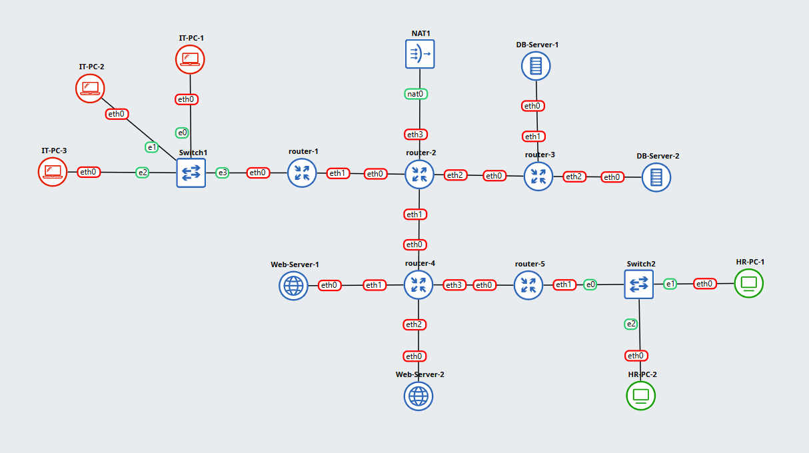
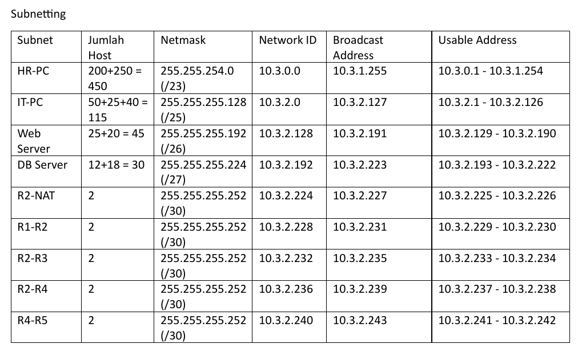
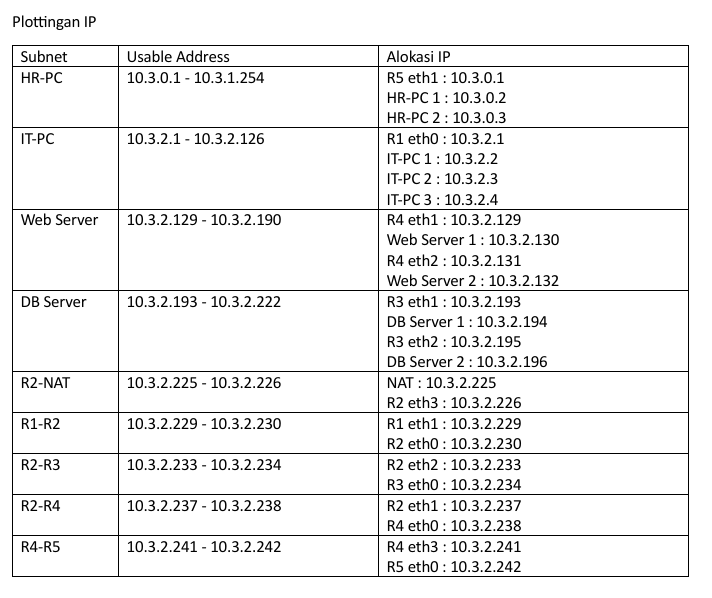
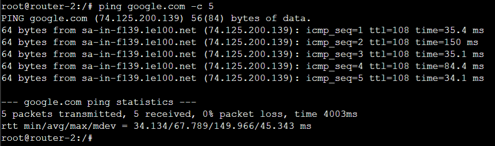
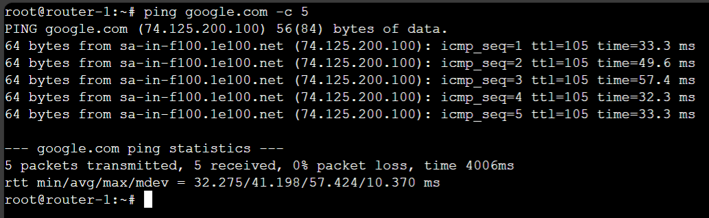
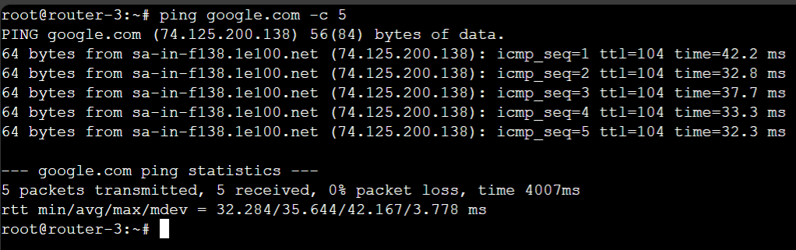
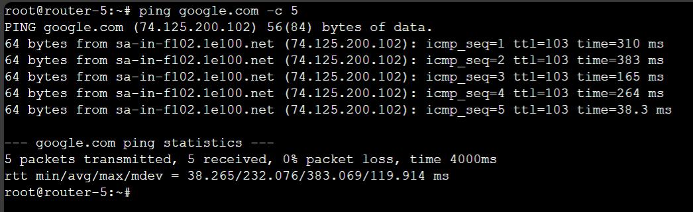
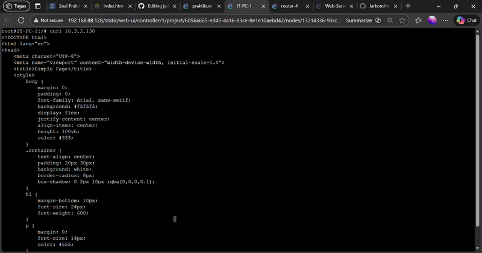
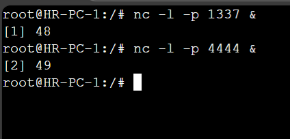

[](https://classroom.github.com/a/oYnIPZ_t)
| Name           | NRP        | Kelas     |
| ---            | ---        | ----------|
| Wahid Badar Abiddin | 5025221025 | Kelas A |


## Put your topology config image here!

`Put image in here`



## Put your GNS3 Project file here!

`Put file URL here`
[GNS3](https://github.com/Wbadara/Jarkom/tree/main/modul%204)

<br>

## Soal 1

> Lakukan subnetting pada topologi diatas menggunakan metode VLSM: [Referensi](https://github.com/arsitektur-jaringan-komputer/Modul-Jarkom/tree/master/Modul-4/Subnetting#2-vlsm-variable-length-subnet-masking)  
*Cantumkan juga tabel dan diagram pembagian subnet pada laporan praktikum*.


> _Subnet the topology above using the VLSM method: [Reference](https://github.com/arsitektur-jaringan-komputer/Modul-Jarkom/tree/master/Modul-4/Subnetting#2-vlsm-variable-length-subnet-masking)_  
_Also include the subnet table and diagram in the lab report._

**Answer:**

- Screenshot

  `Put your screenshot in here`

  
  
  

- Explanation

  `Put your explanation in here`
  Hal pertama yang saya lakukan adalah menghitung banyaknya subnet dan host yang terdapat di topologi. Setelah itu mencocokkan netmask yang sesuai dan melakukan range IP yang dibutuhkan untuk semua host. Kemudian membuat alokasi IP untuk masing masing node.
  Untuk bagian IP di R2 eth3 yang nyambung ke NAT aku coba buat IP statis untuk jaga-jaga namun jika kedepannya tidak berhasil maka akan menggunakan IP dinamis.

<br>

## Soal 2

> Buatlah agar router-2 dapat melakukan koneksi ke internet. [Dapat menggunakan static routing].

> _Make sure router-2 can connect to the internet. [Can use static routing]._

**Answer:**

- Screenshot

  `Put your screenshot in here`

  

- Explanation

  `Put your explanation in here`
  Nyalakan semua node dan setelah eth3 pada R2 mendapat IP dari NAT bisa cek koneksi ke internet.
  ```
  ping google.com -c 5
  ```
  lalu install iptables
  ```
  apt-get update
  apt-get install iptables
  ```
  pasang aturan iptables untuk NAT
  ```
  iptables -t nat -A POSTROUTING -o eth3 -j MASQUERADE
  ```

<br>

## Soal 3

> Setelah mengimplementasi subnetting, buatlah agar seluruh topologi dapat terhubung. Lakukan Dynamic Routing pada topologi tersebut.
*Pastikan seluruh node yang ada dapat mengakses internet*.

> _After implementing subnetting, ensure the entire topology is connected. Perform dynamic routing on the topology._  
_Ensure all existing nodes can access the internet._

**Answer:**

- Screenshot

  `Put your screenshot in here`
  
  

  

  

- Explanation

  `Put your explanation in here`
  Karena menggunakan dynamic routing maka aku akan melakukan pengaturan pada masing masing router yang terhubung ke subnet.
  Di semua router
  ```
  cd /usr/lib/frr
  ```
  lalu nyalakan semua service yang diperlukan
  ```
  ./zebra -d
  ./ripd -d
  ./mgmtd -d
  ```
  Sekarang kita akan mengatur FRR di masing masing router
  ```
  vtysh
  ```
  menjalankan command berikut di dalam `vtysh`
  ```
  conf t
  router rip
  ```
  selanjutnya
  ```
  router 1
  network 10.3.2.0/25
  network 10.3.2.228/30
  
  router 2
  network 10.3.2.228/30
  network 10.3.2.232/30
  network 10.3.2.236/30
  default-information originate    (untuk menyebarkan static routing)
  
  router 3
  network 10.3.2.232/30
  network 10.3.2.192/27
  
  router 4
  network 10.3.2.128/26
  network 10.3.2.236/30
  network 10.3.2.240/30
  
  router 5
  network 10.3.2.240/30
  network 10.3.0.0/23
  ```
  Lalu di semua router, kembali ke tampilan awal
  ```
  exit
  exit
  exit
  cd
  ```
  Cek nameserver di semua node tidak hanya router
  ```
  nano /etc/resolv.conf
  ```
  ```
  nameserver 192.168.122.1  (ini yang sekarang, menyesuaikan)
  ```
  Setelah itu bisa cek koneksi ke internet di semua node
  ```
  ping google.com -c 5
  ```

<br>

## Soal 4

> Lakukan setup web server dengan file html di attachment berikut: [ Attachment ](https://drive.google.com/file/d/199qwfTNJCkxDV7mdO-MsaDdApkmKsnAG/view?usp=sharing)  menggunakan nginx pada “Web-Server-1” dan “Web-Server-2”.  
*Config dibebaskan kepada praktikkan dengan catatan menggunakan port 80*.

> _Set up a web server with the HTML file in the following attachment: [ Attachment ](https://drive.google.com/file/d/199qwfTNJCkxDV7mdO-MsaDdApkmKsnAG/view?usp=sharing) using nginx on “Web-Server-1” and “Web-Server-2”._
_Configuration is free to practice, but note that it uses port 80._

**Answer:**

- Screenshot

  `Put your screenshot in here`

  

- Explanation

  `Put your explanation in here`
  Pada node Web-Server lakukan konfigurasi berikut
  ```
  apt-get update
  apt-get install nginx
  ```
  Buat drektori baru pada `/var/www/`, dengan nama web
  ```
  mkdir /var/www/web
  ```
  Buat file HTML pada direktori `/var/www/web/`, kemudian isi dengan file HTML yang diberikan
  ```
  node Web-Server-1
  nano /var/www/web/index.html

  node Web-Server-2
  nano /var/www/web/index.html
  ```
  
  Pada setiap node, buat file server block pada direktori `/etc/nginx/sites-available/` dengan nama web
  ```
  nano /etc/nginx/sites-available/web
  ```
  ```
  node Web-Server-1
  server {
      listen 80;
      server_name 10.3.2.130; 

      error_log /tmp/error.log;
      access_log /tmp/access.log; 

      root /var/www/web;
      index index.html;

      location / {
          try_files $uri $uri/ =404;
      }
  }

  node Web-Server-2
  server {
      listen 80;
      server_name 10.3.2.132; 

      error_log /tmp/error.log;
      access_log /tmp/access.log; 

      root /var/www/web;
      index index.html;

      location / {
          try_files $uri $uri/ =404;
      }
  }
  ```
  Setelah selesai melakukan konfigurasi pada node Web-Server
  ```
  ln -s /etc/nginx/sites-available/web /etc/nginx/sites-enabled
  ```
  ```
  service nginx restart
  ```

  Setelah berhasil berjalan, sekarang waktunya tes di IT-PC-1
  ```
  curl 10.3.2.130
  curl 10.3.2.132
  ```

<br>

## Soal 5

> Kalian diminta untuk melakukan drop semua paket TCP yang masuk  ke subnet HR dengan port 1337 dan 4444. Lakukan testing dengan netcat.

> _You are asked to drop all incoming TCP packets to the HR subnet with ports 1337 and 4444. Test with netcat._

**Answer:**

- Screenshot

  `Put your screenshot in here`

  

  

- Explanation

  `Put your explanation in here`
  Untuk melakukan drop semua paket TCP yang masuk ke subnet HR-PC dengan port 1337 dan 4444 maka perlu adanya firewall. Subnet HR-PC itu terhubung dengan router-5 maka pengaturan dilakukan di router-5
  ```
  apt-get update
  apt-get install iptables
  ```
  ```
  iptables -A FORWARD -i eth0 -o eth1 -p tcp --dport 1337 -j DROP
  iptables -A FORWARD -i eth0 -o eth1 -p tcp --dport 4444 -j DROP
  ```
  lakukan tes dengan netcat di IT-PC-1 dan HR-PC-1
  ```
  pada HR-PC-1
  nc -l -p 1337 &
  nc -l -p 4444 &

  pada IT-PC-1
  nc -v 10.3.0.2 1337
  nc -v 10.3.0.2 4444
  ```
  harusnya tidak ada balasan di HR-PC-1

<br>

## Soal 6

> Lakukan pembatasan sehingga koneksi SSH pada semua Web Server hanya dapat dilakukan oleh user yang berada pada node IT-PC-1, IT-PC-2, dan IT-PC-3. 

> _Implement restrictions so that SSH connections to all Web Servers can only be made by users on nodes IT-PC-1, IT-PC-2, and IT-PC-3._

**Answer:**

- Screenshot

  `Put your screenshot in here`

- Explanation

  `Put your explanation in here`
  Karena subnet Web Server terhubung ke router-4 maka firewall akan dilakukan di router-4
  ```
  apt-get update
  apt-get install iptables
  ```
  ```
  iptables -A FORWARD -s 10.3.2.0/25 -d 10.3.2.128/26 -p tcp --dport 22 -j ACCEPT
  iptables -A FORWARD -d 10.3.2.128/26 -p tcp --dport 22 -j DROP
  ```
  pengaturan koneksi ssh di Web-Server
  ```
  apt install openssh-server -y
  (perlu install karena belum ada)
  ```
  lakukan tes koneksi ssh dari IT-PC-2 dan HR-PC-2
  ```
  ssh user@10.3.2.130
  ```

<br>

## Soal 7

> Semua subnet hanya dapat mengakses semua DB-Server pada port 80 dan 443 (DB-Server-1 dan DB-Server-2) pada hari Senin-Sabtu, pukul 07:00- 22:00.

> _All subnets can only access all DB-Servers on ports 80 and 443 (DB-Server-1 and DB-Server-2) on Monday-Saturday, 07:00-22:00._

**Answer:**

- Screenshot

  `Put your screenshot in here`

- Explanation

  `Put your explanation in here`

<br>

## Soal 8

> Kemudian, buat agar “Web-Server-1” dan “Web-Server-2” hanya memperbolehkan traffic bertipe HTTP.

> _Then, make sure that “Web-Server-1” and “Web-Server-2” only allow HTTP type traffic._

**Answer:**

- Screenshot

  `Put your screenshot in here`

- Explanation

  `Put your explanation in here`

<br>

## Soal 9

> Pilih salah satu Subnet dan lakukan blokir terhadap semua request protokol ICMP (ping) dari luar subnet terhadap subnet tersebut.

> _Select one of the Subnets and block all ICMP protocol requests (ping) from outside the subnet to that subnet._

**Answer:**

- Screenshot

  `Put your screenshot in here`

- Explanation

  `Put your explanation in here`

<br>

## Soal 10

> Konfigurasikan fitur logging untuk melakukan log terhadap seluruh paket yang di-DROP pada lalu lintas setiap node.

> _Configure the logging feature to log all dropped packets on each node's traffic._

**Answer:**

- Screenshot

  `Put your screenshot in here`

- Explanation

  `Put your explanation in here`

<br>
  
## Problems

## Revisions (if any)
